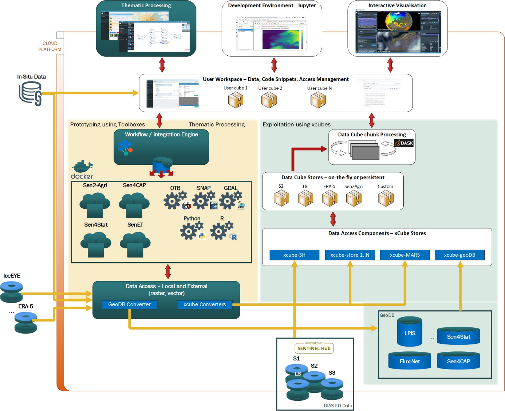
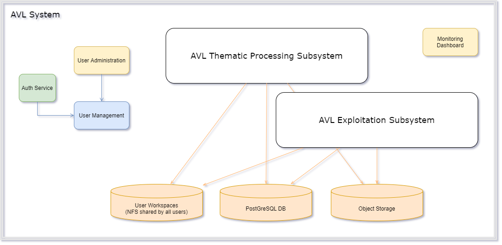

# System Design: overall architecture and common components

This section describes the overall software architectural design, identifying
the software components, their hierarchical relationships, and their
dependencies. It also describes system components common to the two main
subsystems (processing and exploitation).

## Overall Architecture

The following component diagrams present the main software components
that compose the AVL platform:

**Platform components**

The Exploitation subsystem is closely integrated with the Thematic processing
subsystem, which serves as a source of relevant data sets to be explored by
AVL's users, other data sources such as Sentinel Hub or xcube geoDB, and the
user-facing applications Jupyter Lab and the Interactive Visualisation.
Moreover, both subsystems share a couple of Common Components.

## Software components design – common

The AVL Thematic Processing and AVL Exploitation subsystems share
several common components. This section describes the components
depicted in the following diagram:

**Common Components used by the two subsystems**

Please note that data visualisation is not a component on its own. Each
subsystem is having its own specialised data viewers.

### Authentication, authorization, and user management

#### General

The Authentication and Authorization component provides the
implementation for user access to the AVL platform, secures user access
to the application, and manages user permissions to different parts of
the platform.

The service also provides API access tokens to authenticated clients, which are
then used by a service to authorise internal and external access.

The use of a dedicated authentication and authorization service allows the
implementation of a single sign-on system for all the subcomponents of the
AVL, so that a user only needs to log in once to use all the components, and
log out once at the end of their session.

#### Function

The Authentication and Authorization component provides an interface
that is implemented by the authentication specific mechanism, so
that this mechanism can be changed or decoupled from the interface.
Also, there is an authorization interface which is implemented by the
authorization mechanism providing the user authorization through the
system.

Authentication and authorization in the AVL are implemented using
[Keycloak](https://www.keycloak.org/), an open-source software package which
provides extensive identity and access management (IAM) functionality. AVL's IAM
resources are managed within a dedicated realm on a Keycloak server; since
a Keycloak server can host multiple realms, this means that a dedicated
Keycloak server is not necessary for AVL.

#### Dependencies

Keycloak is implemented in Java, and its only external dependency is an
OpenJDK 11 runtime environment. Other dependencies, notably the WildFly
application server, are bundled with the Keycloak distribution itself.

#### Interfaces

For configuration and administration, Keycloak provides three main interfaces:
an HTTP REST API, an interactive web GUI, and a provider for the Terraform
configuration management system.

For interfacing with clients, Keycloak supports the OpenID Connect (OIDC)
protocol (implemented using OAuth 2.0) and Security Assertion Markup Language
(SAML). All current AVL Keycloak clients interface with the Keycloak server
using OIDC.

#### Data

The most important resources which Keycloak manages within the AVL realm are:

Users
:   Users of the system, including their group membership, personal details, and
login credentials.

Clients
:   Other parts of the AVL system which make use of the Keycloak subsystem
to manage user authentication and authorization.

Groups
:   Used to manage user authorization levels. AVL uses two groups representing
different privilege levels: `service_users` for ordinary users and
`service_providers` for administrators. Group membership is communicated to
clients during the user log-in process; the client can then use this
information to provide appropriate user privileges.

Roles
:   Used for fine-grained authorization control, for instance management of read
and/or write access to the various AVL object storage buckets. Like group
memberships, a user's current roles are communicated to the client during
log-in.

### Object storage

#### General

The main purpose of object storage is to be a performant, cloud-ready, and
cost-effective store for the large amounts of data AVL needs to manage. The
Thematic Processing System generates data cubes into the object storage, while
the AVL exploitation system reads the data cubes from the object storage. The
standard data format for the data cubes is
[Zarr](https://zarr.readthedocs.io/en/stable/), but other data formats are
also supported as required (e.g. NetCDF, GeoTIFF).

The object storage buckets serve several purposes within the AVL system:

-   They store read-only, pre-generated datasets of general interest to
    AVL users.

-   They store data generated by the thematic processing system, allowing
    it to be read seamlessly by the exploitation system and xcube viewer.

-   They store data written by the exploitation system, allowing it to
    be viewed in the xcube viewer.

-   They allow users to share their generated and processed data, selectively,
    with each other.

The object storage is provided by the cloud environment used for the AVL
deployment.

Several standard user-accessible AVL object storage buckets are provided, with
particular purposes and access settings:

-   `user-private`: personal, private object storage. Users can only read
    and write under their own user prefix, similar to a home directory.
  
-   `user-public`: shared user data. Users can only write under their own
    user prefix, but all data is readable to all users.
  
-   `scratch`: temporary shared storage. All AVL users can read and write
    freely in the whole bucket, and data are deleted automatically after two
    days.
  
-   `data`: pre-processed, standard data sets made available for all users by
    the AVL project.
  
-   `staging`: a staging area for the data_store store. Data here are migrated
    to the `data` bucket once they have been thoroughly tested.
  
-   `test`: A pre-staging area for the `staging` and `data` buckets. Data here
    are migrated to `staging` after some initial testing.

The xcube package includes a general data store implementation for S3 object
storage. Therefore, users are not restricted to these standard S3 buckets:
they can create new xcube data stores to read and write data using any public
external S3 bucket, or any non-public bucket for which they have access
credentials.

User access to the standard buckets is managed by the application of
appropriate AWS IAM policies to both buckets and IAM users by a Python module
in the AVL codebase. The module is used at two points in the S3 bucket
lifecycle:

- By the system operator, to create the buckets and associated resources
  (policies, IAM users, and permissions boundaries) during initial set-up
  and configuration of the AVL.

- By the Jupyter Hub runtime, to create IAM users (if required) on user
  log-in and configure their bucket access via IAM policies; see the
  Jupyter Hub section of this documentation for further details.

In addition to the user-accessible buckets, there is a configuration bucket
`xcube-viewer-app` which provides the configuration for the xcube viewer
component of the exploitation subsystem.

Data usage in the user-writeable buckets is automatically monitored by an
automatic storage monitoring subcomponent, which alerts the AVL operators via
email if excess usage is detected.

#### Function

The function of the object storage system is similar to that of a traditional
computer file system: to provide persistent storage of and access to blocks of
data (‘files’ in a traditional file system; ‘objects’ in an object storage
system) referenced by string identifiers (‘filenames’ in a traditional file
system; ‘keys’ in an object storage system). The main advantages of the object
storage system are its standardized HTTP API, simplicity of access,
reliability, support for complex, sophisticated access policies, and – perhaps
most importantly – scalability (especially when used with the Zarr data
format) to very large datasets.

#### Dependencies

The Object Storage component uses IAM policies created by the User Management
component to manage user read and write permissions for its buckets.

#### Interfaces

The Object Storage main interface is a REST API compatible with the [AWS
S3 API](https://docs.aws.amazon.com/AmazonS3/latest/API/Welcome.html).

Thanks to the AWS S3 compatibility, there are many software tools and
libraries that can be used as middleware to access the Object Storage. In
particular, an S3 bucket can be mounted on several operating systems as a
pseudo-filesystem using the [s3fs-fuse
backend](https://github.com/s3fs-fuse/s3fs-fuse).
