# AVL Exploitation System Design

This chapter describes the software architectural design, identifying
the software components, their hierarchical relationships and
dependencies.

## Overall Architecture

The following component diagrams present the main software components
that compose the AVL platform:

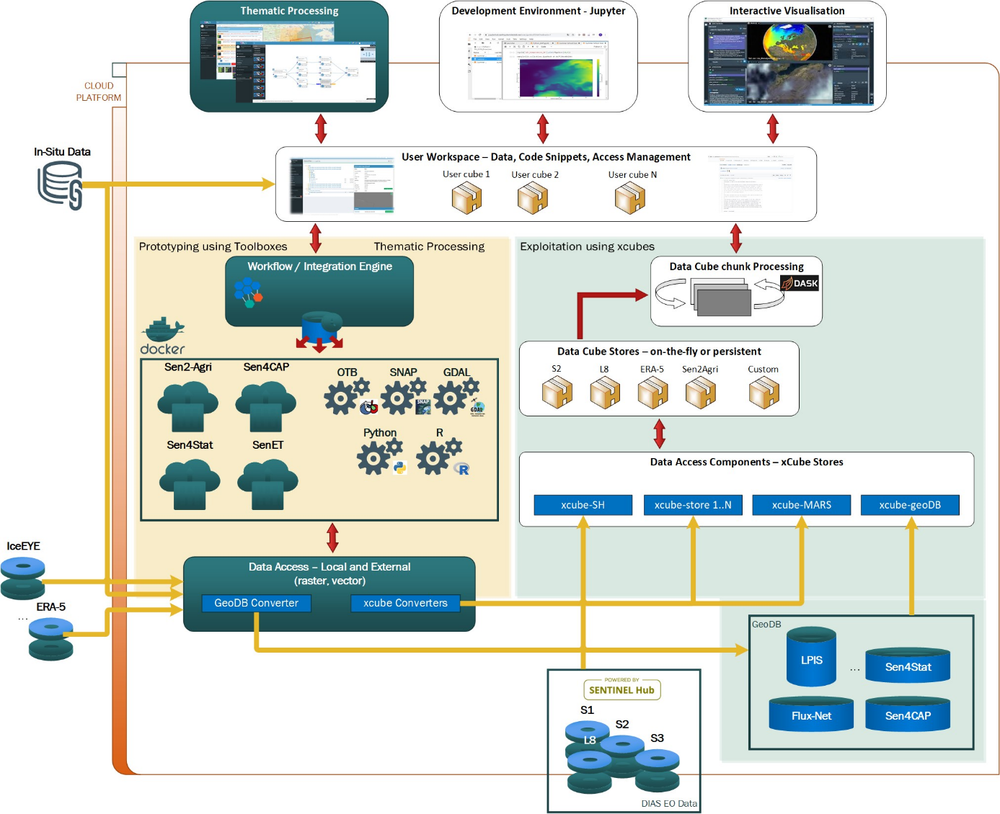
**Platform components**

The Exploitation subsystem is closely integrated with the Thematic processing
subsystem, which serves as a source of relevant data sets to be explored by
AVL's users, other data sources such as Sentinel Hub or xcube geoDB, and the
user-facing applications Jupyter Lab and the Interactive Visualisation.
Moreover, both subsystems share a couple of Common Components.

## Software Components Design – Common

The AVL Thematic Processing and AVL Exploitation subsystems share
several common components. This section describes the components
depicted in the following diagram:

**Common Components used by the two subsystems**

Please note that data visualisation is not a component on its own. Each
subsystem is having its own specialised data viewers.

### Authentication and Authorization

#### General

The Authentication and Authorization component contains the
implementation for user access to the AVL platform, secures user access
to the application, and manages user permissions to different parts of
the platform.

#### Function

The Authentication and Authorization component provides an interface
that is implemented by the authentication specific mechanism, so
that this mechanism can be changed or decoupled from the interface.
Also, there is an authorization interface which is implemented by the
authorization mechanism providing the user authorization through the
system.

#### Dependencies

Every graphical user interface module that calls backend business logic
needs to authenticate in order to have access to the desired data.
The Authentication and Authorization component uses encryption and
hashing mechanisms. It also uses the Persistence Manager component
for database users and permissions management.

#### Interfaces

The main interfaces in term of data flow of this component are:

- As inputs:
  - The username and password for login,
  - The user password for password reset.
- As outputs:
  - The login action result (successful or not),
  - The password reset action result (successful or not).

#### Data

The data handled by this component are the user's credentials and
rights, which, depending on the authentication mechanism, can be
retrieved from the AVL database using Persistence Manager or from an
external authentication and authorization user management system. The
service also provides API access tokens to authenticated clients, which
are then used by a service to authorise internal and external access.

#### Remarks

AVL uses the [*Keycloak*](https://www.keycloak.org/)
software for simplifying, but also to increase the spectrum of, the
authentication mechanism. Keycloak adds authentication to applications
and secures services with minimum work. It supports, among others, user
federation, identity brokering and social login.

### User Management

#### General

The User Management component contains the implementation for user
management in the AVL platform. The purpose of the User Management
component is to define the users allowed to use the platform, and to
define their quota in terms of storage and computing resources (CPU,
memory).

#### Function

The User Management component provides an interface so that all other
components interfering with the user management will use the functionalities
exposed by it. The main functionalities of the component are:

- add a new user by providing a username and an email address,

- update user credentials (by setting password provided by user after
  account activation),

- set and update user quota,

- remove/deactivate a user.

#### Dependencies

The User Management component uses the Persistence Manager component for
storing user details in the AVL database.

#### Interfaces

The module exposes a Java API (for integration with other Java
components) and a REST API (for usage from heterogeneous clients,
including web clients).

#### Data

The data handled by this component are the user details (credentials and
quota), which can be saved/retrieved into/from the AVL database using
Persistence Manager.

### Object Storage

#### General

The main purpose of Object Storage is to be a performant,
cloud-ready, and cost-effective store for the large amounts of data AVL
needs to manage. The Thematic Processing System generates data cubes
into the object storage, while the AVL exploitation system reads the
data cubes from the object storage. The data format for the data cubes
is [Zarr](https://zarr.readthedocs.io/en/stable/).

The Object Storage is provided by the cloud environment used for the AVL
deployment.

#### Function

The function of the Object Storage is that of any other file system. Its main
advantage is its accessibility via HTTP, the simplicity of access, and
reliability.

#### Dependencies

None.

#### Interfaces

The Object Storage main interface is a REST API compatible with the [AWS
S3 API](https://docs.aws.amazon.com/AmazonS3/latest/API/Welcome.html).

Thanks to the AWS S3 compatibility, there are many software tools and
libraries that can be used as middleware to access the Object Storage.

### System Monitoring Dashboard

#### General

The System Monitoring component (and dashboard) provides real-time
information about system activities and system resource usage.

#### Function

The dashboard monitoring related functions are:

- view the currently used system resources (CPU, memory, time) – accessible
  for both administrator and user roles, with the difference that the user can
  only view the resources used by his running jobs,

- view job execution details – accessible for both administrator and user
  roles, with the difference that the user can only view his jobs execution
  details,

- view jobs execution status – accessible for both administrator and user
  roles, with the difference that the user can only view his jobs execution
  status,

- view user quota status – accessible for both administrator and user roles,
  with the difference that the user can only view his quota status,

- view the platform statistics – accessible only for AVL administrators.

#### Dependencies

The module depends on the Thematic Workflow Engine and Data Cube
Processing Engine for activity monitoring.

#### Interfaces

The module exposes a Java API (for integration with other Java
components) and a REST API (for usage from heterogeneous clients,
including web clients).

### User Workspace Manager

#### General

The purpose of the User Workspace Manager component is twofold: it
ensures the privacy of users (their data is protected from other users)
and it allows the quota management (the quantity of infrastructure
resources – such as storage, CPU, memory – a user can use).

#### Function

The following functions are performed by this component:

- View the details about local data products (accessible for both
  administrator and user roles, with the difference that the user can only
  view details about his local data products as well as public data
  products),

- Upload additional files that can be further used in workflows (such as
  model files, shape files, etc.),

- Publish (share) data products with other users,

- Monitor user quota.

Note: The AVL Toolbox Hub includes its own workspace management. It is,
however, dependent on the same User Workspace NFS share. For users of
the AVL system, this will be transparent.

#### Dependencies

The workspace manager depends on the User Workspace NFS shares common
component.

#### Interfaces

The module exposes a Java API (for integration with other Java
components) and a REST API (for usage from heterogeneous clients,
including web clients).

Note: The AVL Toolbox service exposes an API (WebSocket-based JSON RPC)
to let users manage just *their* private workspace.

### Thematic Workflow Engine

#### General

The Thematic Workflow Engine is in charge with execution of workflows by
creating and handling jobs and performing the management of the
execution steps from a workflow. The purpose of the Orchestration is to
allow the execution of a workflow, by creating a job for each workflow
execution, splitting and managing the internal components of the
workflow in execution tasks.

#### Function

The main functionalities realized by this component are:

- Parse the Workflow definition and extract the tasks to be executed,

- Handle the parameters to be used in each processing component
  (mapped to a task),

- Upon reception of a new workflow execution request, creates a new
  execution job in the database and its execution tasks, corresponding
  to the workflow components,

- Determines the tasks to be executed at a given moment of time and
  submit them to the corresponding executor,

- Monitors the execution statuses of the tasks in order to decide the
  next actions to be performed,

- Manages the job operations requests like pause, cancel or resume,

- Marks the jobs executions as finished or failed, according to the
  task execution results.

The component is comprised of several constituents:

##### Orchestrator

This is the component that performs the functionalities above. It uses
the ExecutionsManager that undertakes the tasks executions,
according to the mode in which the platform is configured.
In this architecture, the Orchestrator is in charge with the workflow
steps extraction and decide the next steps to be executed from the
workflow while the executor is in charge with the effective execution
and monitoring the execution statuses of the current executing tasks.

##### ExecutionsManager

The ExecutionsManager is in charge of executions of the tasks that the
Orchestrator needs to perform during a workflow execution. It implements
the following functions:

- Prepares the parameters of the execution via an ExecutionAdapter and
  will send the new task command line to be executed to the Cluster
  Manager,

- Determines the node where the execution should be performed
  depending on the nodes configured for the executed processing
  component (or creates a new one),

- Monitors and eventually receives notifications about the changes in
  the execution status of the current executing tasks (task pending
  for start, running, finished, cancelled) and saves them into the
  database,

- Monitors and eventually receives the logs generated by the
  processing component (progress messages or error messages) and saves
  them in the database for the current task. In this manner, the AVL
  GUI will have the possibility to display to the user the task
  messages in near-real-time or at the end of the execution,

- Can request to the ExecutionsManager to cancel, pause or resume the
  execution of a task,

- Upon the finalization of the execution of a task, the
  ExecutionsManager is also in charge to insert into the database the
  metadata of the resulted output products (if they were configured in
  such manner).

Upon the execution of a task, the ExecutionsManager performs the
following operations:

- Before starting the execution, the ExecutionsManager creates the
  command line to be executed for the processing component considering
  the descriptor of the processing component and the provided
  parameters values to be used for execution. Some of the values are
  provided by the orchestrator that determined the outputs (if it is
  the case) of the previous task(s) to be used as inputs for the
  current execution.

- The ExecutionsManager then checks, in the case of a distributed
  configuration, the load and the limitations set for the nodes where
  the component needs to be executed and filters, if necessary, the
  machines where to execute the task along with the memory or CPU
  limitations,

- Once a task is submitted for execution, the ExecutionsManager marks
  the task in the database as SUBMITTED. After tasks submission, the
  ExecutionsManager will be in charge to monitor the status of the
  currently executing jobs and to notify the Orchestrator about the
  changes in the execution state of a certain task. The monitoring
  operation is performed by requesting periodically to the Cluster
  Manager information about the job statuses. The DRMAA specifications
  also provide the possibility to receive callback notification about
  Cluster Manager job execution state changes but this depends on the
  DRMAA implementation for that specific Cluster Manager (for example,
  changing the cluster manager from Torque to Slurm might show that
  the callback notifications are not supported by the DRMAA
  implementation for Slurm). The changes detected by the
  ExecutionsManager in the state of an executing task (if the
  execution was started if it is still in the pending state of if it
  finished) are marked in the database as events that can be read by
  the Orchestrator but also that can be read by the IHM in order to
  present the current execution state of the tasks.

- During the execution of a task, it is necessary to also extract the
  log messages (progress, debug, errors etc.) of the processing
  component execution. The ExecutionsManager will be also in charge to
  retrieve periodically the log messages of the execution tasks that
  are currently in the RUNNING state. This will be also performed by
  polling, using the API of the Cluster Manager for getting the
  messages (for example, qpeek, in case of Torque) that are displayed
  in real time to the user, in the IHM. At the end of the execution of
  a task, the ExecutionsManager will retrieve, if necessary, the full
  log file and will make it available to the user.

##### Executor

The Executor component is used to execute the tasks command lines via
the DRMAA interface. It provides the API for:

- Start the execution of the processing components using the specified
  command line,

- Stop/suspend or resume the execution of the processing components,

- Provide information about the progress of the execution and logs,

- Specific functions from DRMAA specifications,

- Custom functions demanded by the AVL platform (listeners,
  initialization functions etc.).

Although there are several implementations already available in the TAO
framework, AVL will use one of the following two implementations:

- A process executor using SSH,
- A Kubernetes executor.

#### Dependencies

The Orchestrator depends on the following components:

- The Persistence Manager – for saving execution information like
  logs and task states into the database,

- The Cluster Manager – for executing the job tasks.

#### Interfaces

The module exposes a Java API (for integration with other Java
components) and a REST API (for usage from heterogeneous clients,
including web clients).

#### Data

The data that the Thematic Workflow Engine is handling is:

- Parameters of the execution (including information about the
  products and the actual product files that are used in the
  execution),

- Description of the processing component that defines the inputs, the
  outputs and their types, the type of the processing component
  (either a script or a WPS server),

- The progress, log and error messages,

- Configuration of the nodes where the execution takes place.

### Thematic Workflow Management

#### General

The Workflow Management component contains the implementation for
workflow management for the thematic processing subsystem. The purpose
of the Workflow Management component is to allow processing and
pre-processing workflows parametrization for chaining multiple operators
on input satellite products.

#### Function

The main functionalities exposed by this component are:

- retrieve the list of workflows that a given user can see,
- clone an existing workflow,
- parameterize a workflow according to the user needs,
- create a workflow from existing toolboxes,
- validate a workflow,
- publish a workflow.

#### Dependencies

The Workflow Management component uses the Persistence Manager component
for saving and updating the workflow related data into the AVL database.

#### Interfaces

The module exposes a Java API (for integration with other Java
components) and a REST API (for usage from heterogeneous clients,
including web clients).

#### Data

The data handled by this component are the workflow details (name,
definition, identifier, visibility flag, etc.), which can be
saved/retrieved into/from the AVL database using Persistence Manager.

### Data Sources Manager

#### General

The Data Sources Manager component handles the external data source
modules in the AVL platform. The purpose of the Data Sources Manager
component is to allow data sources visualization and configuration for
their usage in workflows creations.

#### Function

The main functionalities exposed by the component are:

- retrieve all existing data sources visible by a given user,

- retrieve the parameters of a data source,

- update the parameters of a data source,

- save a user data product (resulted from a data source interrogation
  or privately owned).

#### Dependencies

The Data Sources Manager component uses the Persistence Manager
component for saving and updating the data sources and data products
related data into the AVL database. It also depends on the data source
plugins that are installed in the platform.

#### Interfaces

The module exposes a Java API (for integration with other Java
components) and a REST API (for usage from heterogeneous clients,
including web clients).

#### Data

The data handled by this component are the data sources details (name,
type, description, connection details and other parameters, etc.), which
can be saved/retrieved into/from the AVL database using the Persistence
Manager.

### xcube Converter Manager

#### General

The xcube Converter Manger handles the format conversion from original
product formats (specific to external data providers or to thematic
processing subsystem components) to Zarr format (specific to data
cubes).

#### Function

The module manages individual converters from:

- formats specific to external data providers,

- formats specific to processing subsystem components (such as
  Sen2Agri, etc.)

#### Dependencies

The xcube Converter Manager depends on Workspace Management for
retrieving the data products and writing data cubes.

#### Interfaces

The module exposes a Java API (for integration with other Java
components)

## Software Components Design – Thematic Processing System

The thematic processing sub-system is a collection of self-contained
(i.e., packed in Docker containers) applications or systems, that
produce value-added EO products (such as crop masks, crop types,
agricultural practices, etc.).

The sub-system has at its core the TAO Workflow and Integration engine.
TAO (stands for Tool Augmentation by user enhancements and
Orchestration) is an open-source (under GPLv3 license) lightweight,
generic integration, and distributed orchestration framework. It allows
the integration of commonly used toolboxes (such as, but not limited to,
**SNAP, Orfeo Toolbox, GDAL,** etc.) into a single user environment.
This framework allows for processing composition and distribution in
such a way that end users could define by themselves processing
workflows and easily integrate additional processing modules (either
standalone executables or Python or R scripts).

In terms of use, the TAO platform provides a mean for orchestration of
heterogeneous processing components and libraries to process remote
sensing data. This is achieved in following steps:

- Preparation of resources (including processing components) and data
  input,

- Definition of a workflow as a processing chain,

- Execution of workflows,

- Retrieval / visualisation / sharing of the results.

The following diagram details the AVL Thematic Processing subsystem
whose components are described hereafter:

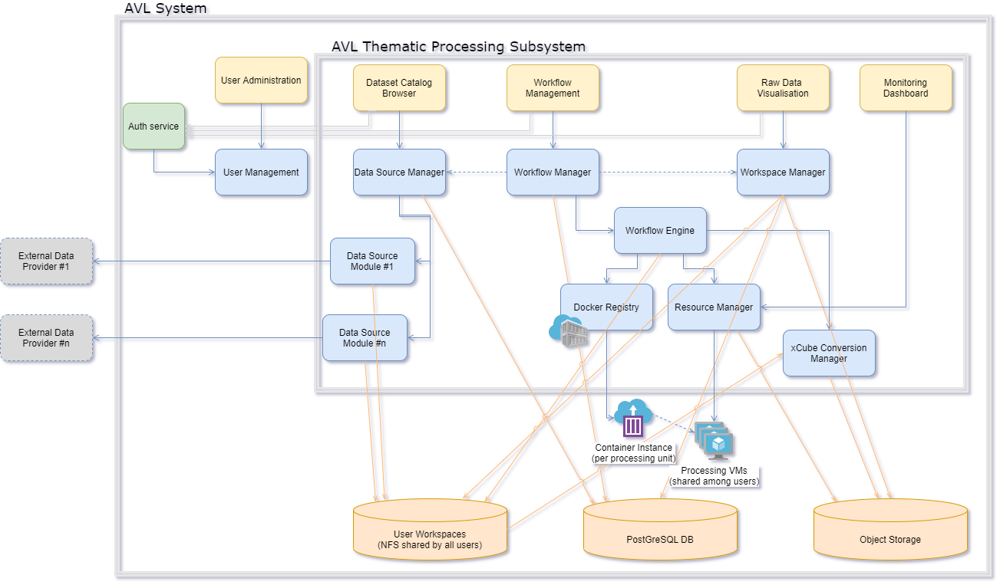
**AVL Thematic Subsystem**

### Dataset Catalogue Browser

#### General

The purpose of the Dataset Catalogue Browser is to expose to users the
datasets (local or remote) that are available for usage in AVL.

#### Function

The Dataset Catalogue Browser allows for:

- Listing the available data providers,

- Listing the available data sets for each provider,

- Searching for specific data products in a uniform way (different
  providers may have different filters for searching data),

- Retrieving the selection of data products to the user workspace.

#### Dependencies

The module relies on the Data Sources Manager component for listing the
available data providers and searching and/or fetching the data
products.

#### Interfaces

The module has a web interface with different pages for listing the
available data providers and for searching and retrieving data products:

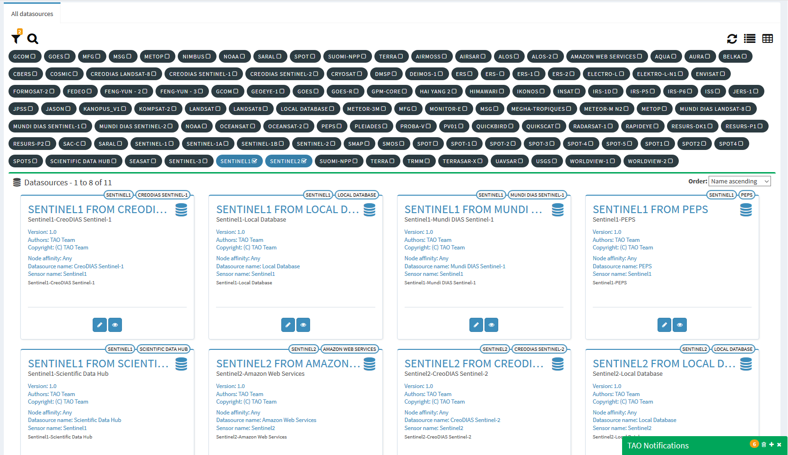
**TAO Data Provider List**

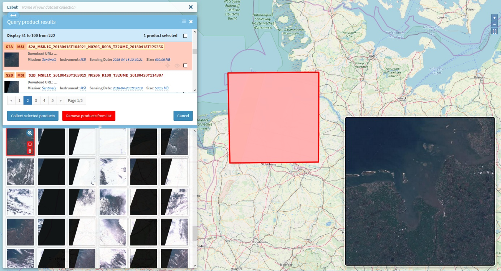
**TAO Data Products Search**

These interfaces will be modified to better suit the AVL needs and to
accommodate the overall AVL UI look and feel.

### User Workspace Manager

#### General

The purpose of the User Workspace Manager component is twofold: it
ensures the privacy of users (their data is protected from other users)
and it allows the quota management (the quantity of infrastructure
resources – such as storage, CPU, memory – a user can use).

#### Function

The following functions are performed by this component:

- View the details about local data products (accessible for both
  administrator and user roles, with the difference that the user can
  only view details about his local data products as well as public
  data products),

- Upload additional files that can be further used in workflows (such
  as model files, shape files, etc.),

- Publish (share) data products with other users,

- Monitor user quota.

Note: The AVL Toolbox Hub includes its own workspace management. It is,
however, dependent on the same User Workspace NFS share. For users of
the AVL system, this will be transparent.

#### Dependencies

The workspace manager depends on the User Workspace NFS shares common
component.

#### Interfaces

The module exposes a Java API (for integration with other Java
components) and a REST API (for usage from heterogeneous clients,
including web clients).

Note: The AVL Toolbox service exposes an API (WebSocket-based JSON RPC)
to let users manage just *their* private workspace.

### Thematic Workflow Engine

#### General

The Thematic Workflow Engine is in charge with execution of workflows by
creating and handling jobs and performing the management of the
execution steps from a workflow. The purpose of the Orchestration is to
allow the execution of a workflow, by creating a job for each workflow
execution, splitting and managing the internal components of the
workflow in execution tasks.

#### Function

The main functionalities realized by this component are:

-   Parse the Workflow definition and extract the tasks to be executed,

-   Handle the parameters to be used in each processing component
    (mapped to a task),

-   Upon reception of a new workflow execution request, creates a new
    execution job in the database and its execution tasks, corresponding
    to the workflow components,

-   Determines the tasks to be executed at a given moment of time and
    submit them to the corresponding executor,

-   Monitors the execution statuses of the tasks in order to decide the
    next actions to be performed,

-   Manages the job operations requests like pause, cancel or resume,

-   Marks the jobs executions as finished or failed, according to the
    task execution results.

The component comprises several constituents:

##### Orchestrator

This is the component that performs the functionalities above. It uses
the ExecutionsManager that will undertake the tasks executions,
according to the mode in which the platform is configured.

In this architecture, the Orchestrator is in charge with the workflow
steps extraction and decide the next steps to be executed from the
workflow while the executor is in charge with the effective execution
and monitoring the execution statuses of the current executing tasks.

##### ExecutionsManager

The ExecutionsManager is in charge with executions of the tasks that the
Orchestrator needs to perform during a workflow execution. It implements
the following functions:

-   Prepares the parameters of the execution via an ExecutionAdapter and
    will send the new task command line to be executed to the Cluster
    Manager,

-   Determines the node where the execution should be performed
    depending on the nodes configured for the executed processing
    component (or creates a new one),

-   Monitors and eventually receives notifications about the changes in
    the execution status of the current executing tasks (task pending
    for start, running, finished, cancelled) and saves them into the
    database,

-   Monitors and eventually receives the logs generated by the
    processing component (progress messages or error messages) and saves
    them in the database for the current task. In this manner, the AVL
    GUI will have the possibility to display to the user the task
    messages in near-real-time or at the end of the execution,

-   Can request to the ExecutionsManager to cancel, pause or resume the
    execution of a task,

-   Upon the finalization of the execution of a task, the
    ExecutionsManager is also in charge to insert into the database the
    metadata of the resulted output products (if they were configured in
    such manner).

Upon the execution of a task, the ExecutionsManager will perform the
following operations:

-   Before starting the execution, the ExecutionsManager will create the
    command line to be executed for the processing component considering
    the descriptor of the processing component and the provided
    parameters values to be used for execution. Some of the values are
    provided by the orchestrator that determined the outputs (if it is
    the case) of the previous task(s) to be used as inputs for the
    current execution.

-   The ExecutionsManager then checks, in the case of a distributed
    configuration, the load and the limitations set for the nodes where
    the component needs to be executed and filters, if necessary, the
    machines where to execute the task along with the memory or CPU
    limitations,

-   Once a task is submitted for execution, the ExecutionsManager marks
    the task in the database as SUBMITTED. After tasks submission, the
    ExecutionsManager will be in charge to monitor the status of the
    currently executing jobs and to notify the Orchestrator about the
    changes in the execution state of a certain task. The monitoring
    operation is performed by requesting periodically to the Cluster
    Manager information about the job statuses. The DRMAA specifications
    also provide the possibility to receive callback notification about
    Cluster Manager job execution state changes but this depends on the
    DRMAA implementation for that specific Cluster Manager (for example,
    changing the cluster manager from Torque to Slurm might show that
    the callback notifications are not supported by the DRMAA
    implementation for Slurm). The changes detected by the
    ExecutionsManager in the state of an executing task (if the
    execution was started if it is still in the pending state of if it
    finished) are marked in the database as events that can be read by
    the Orchestrator but also that can be read by the IHM in order to
    present the current execution state of the tasks.

-   During the execution of a task, it is necessary to also extract the
    log messages (progress, debug, errors etc.) of the processing
    component execution. The ExecutionsManager will be also in charge to
    retrieve periodically the log messages of the execution tasks that
    are currently in the RUNNING state. This will be also performed by
    polling, using the API of the Cluster Manager for getting the
    messages (for example, qpeek, in case of Torque) that are displayed
    in real time to the user, in the IHM. At the end of the execution of
    a task, the ExecutionsManager will retrieve, if necessary, the full
    log file and will make it available to the user.

##### Executor

The Executor component is used to execute the tasks command lines via
the DRMAA interface. It provides the API for:

-   Start the execution of the processing components using the specified
    command line,

-   Stop/suspend or resume the execution of the processing components,

-   Provide information about the progress of the execution and logs,

-   Specific functions from DRMAA specifications,

-   Custom functions demanded by the AVL platform (listeners,
    initialization functions etc.).

Although there are several implementations already available in the TAO
framework, AVL will use one of the following two implementations:

-   A process executor using SSH,
-   A Kubernetes executor.

#### Dependencies

The Orchestrator depends on the following components:

-   The Persistence Manager – for saving execution information like
    logs and task states into the database,

-   The Cluster Manager – for executing the job tasks.

#### Interfaces

The module exposes a Java API (for integration with other Java
components) and a REST API (for usage from heterogeneous clients,
including web clients).

#### Data

The data that the Thematic Workflow Engine is handling is:

-   Parameters of the execution (including information about the
    products and the actual product files that are used in the
    execution),

-   Description of the processing component that defines the inputs, the
    outputs and their types, the type of the processing component
    (either a script or a WPS server),

-   The progress, log and error messages,

-   Configuration of the nodes where the execution takes place.

### Thematic Workflow Management

#### General

The Workflow Management component contains the implementation for
workflow management for the thematic processing subsystem. The purpose
of the Workflow Management component is to allow processing and
pre-processing workflows parametrization for chaining multiple operators
on input satellite products.

#### Function

The main functionalities exposed by this component are:

-   retrieve the list of workflows that a given user can see,
-   clone an existing workflow,
-   parameterize a workflow according to the user needs,
-   create a workflow from existing toolboxes,
-   validate a workflow,
-   publish a workflow.

#### Dependencies

The Workflow Management component uses the Persistence Manager component
for saving and updating the workflow related data into the AVL database.

#### Interfaces

The module exposes a Java API (for integration with other Java
components) and a REST API (for usage from heterogeneous clients,
including web clients).

#### Data

The data handled by this component are the workflow details (name,
definition, identifier, visibility flag, etc.), which can be
saved/retrieved into/from the AVL database using Persistence Manager.

### Data Sources Manager

#### General

The Data Sources Manager component handles the external data source
modules in the AVL platform. The purpose of the Data Sources Manager
component is to allow data sources visualization and configuration for
their usage in workflows creations.

#### Function

The main functionalities exposed by the component are:

-   retrieve all existing data sources visible by a given user,

-   retrieve the parameters of a data source,

-   update the parameters of a data source,

-   save a user data product (resulted from a data source interrogation
    or privately owned).

#### Dependencies

The Data Sources Manager component uses the Persistence Manager
component for saving and updating the data sources and data products
related data into the AVL database. It also depends on the data source
plugins that are installed in the platform.

#### Interfaces

The module exposes a Java API (for integration with other Java
components) and a REST API (for usage from heterogeneous clients,
including web clients).

#### Data

The data handled by this component are the data sources details (name,
type, description, connection details and other parameters, etc.), which
can be saved/retrieved into/from the AVL database using the Persistence
Manager.

### xcube Converter Manager

#### General

The xcube Converter Manger handles the format conversion from original
product formats (specific to external data providers or to thematic
processing subsystem components) to Zarr format (specific to data
cubes).

#### Function

The module manages individual converters from:

-   formats specific to external data providers,

-   formats specific to processing subsystem components (such as
    Sen2Agri, etc.)

#### Dependencies

The xcube Converter Manager depends on Workspace Management for
retrieving the data products and writing data cubes.

#### Interfaces

The module exposes a Java API (for integration with other Java
components)

## Software Components Design – Exploitation System

Every laboratory makes use of standard procedures and standard measures
to make any syntheses and analyses reproducible, traceable, comparable,
and effective. A data exploitation laboratory is no exception. We provide 
the majority of AVL data in a standardised, analysis-ready
form to users. The core idea is to let users interact with uniform
multi-dimensional, multi-variate data cubes, whose internal data arrays
are subdivided into smaller chunks. These chunks are stored in a
cloud-ready format and can be read, processed, and written independently
in a concurrent fashion. The chunked structure of data cubes facilitates
scalable, massively parallel data analyses, allows for on-the-fly
processing when only subsets of data are requested. All cubes 
preserve the original metadata of data products and variables and
maintain them in a CF-compliant way.

AVL provides numerous ready-to-use data cubes to users. These
comprise a set of commonly used spatio-temporal coverages and
resolutions for a given sensor and/or use case. Upon user demand, 
EO and non-EO data sources and formats data cubes may be produced either
on-the-fly or persistent into cloud object storage. For this purpose, we use 
the **open source** [***xcube*** **toolkit**](https://xcube.readthedocs.io)
developed by BC. xcube builds on the popular Python data science packages
[*xarray*](http://xarray.pydata.org/en/stable/),
[*dask*](https://dask.org/), [*pandas*](https://pandas.pydata.org/) and
others. By doing to, it shares a common architectural and implementation
basis with other data cube systems such as
[*Pangeo*](https://github.com/pangeo-data) and
[*Open Data Cube*](https://www.opendatacube.org/).

Within xcube, any data source is represented by an **xcube datastore**
implementation. A datastore abstracts from the individual data provision
method and data formats. It allows creating data cube views from any
suitable data source. To foster multi-variate analyses, gridded EO- and
non-EO data as well as EO data in satellite (viewing) geometry can be
resampled to user-provided spatio-temporal resolution grids. This
process is transparent to the user and may include global or local
cartographic projections, down-sampling (aggregating original values),
and up-sampling (interpolating between original values). The responsible
xcube datastore implements the best respective method for a given data
variable.

By using the xcube Python SDK in a **Jupyter Notebook**, user can
directly open data cubes and start interacting with the data. It remains
transparent to the user whether a data cube has been opened from a
persistent instance or whether it is generated on the fly, e.g. by
delegating its data requests to another data provider such as Sentinel
Hub. Apart from the Python SDK, the xcube toolkit comprises powerful
command-line tools for generating, maintaining, and exploiting data
cubes. xcube also provides convenient and intuitive web apps. The
**xcube Viewer app** is used to visualise data cubes and time series.

In addition to these web apps, we will utilise the **ESA CCI
Toolbox Cate** for AVL. This Toolbox has been developed for the
multi-variate, cross-ECV exploitation of the ESA CCI datasets.
Originally planned to run on users' computers, Cate has been recently
turned into a Software-as-Service, comprising an attractive web GUI and a
backend that shares the same Python package stack as xcube. 

In-situ data, and other geo-referenced data, that are not made available via
public, standardized web services will be persisted in a dedicated database,
the **geoDB system**, which has been developed specifically for this purpose.
The geoDB has a comprehensive and intuitive **Python client SDK** so users can
manipulate and access geo-data from their Python programs and Jupyter
Notebooks. A dedicated xcube datastore allows for creating data cube views
from geo-referenced vector data stored in geoDB. This enables the mapping of
vector and feature data into the same coordinate space as a given EO data
cube, e.g. for machine learning tasks or for masking gridded EO data with
vector shapes.

In summary, the exploitation sub-system of AVL comprises the following parts
and **top-level-entry points**:

-   **AVL Juypter Notebooks** – to read, visualise, analyse,
    process, write AVL cubes using Python,

-   **AVL Cube Viewer** – to quickly inspect and visualise
    all AVL cubes and time series,

-   **AVL Cube Toolbox** – to read, visualise, analyse,
    process, write AVL cubes using a powerful GUI.

The following diagram details the AVL Exploitation subsystem whose
components are described hereafter:

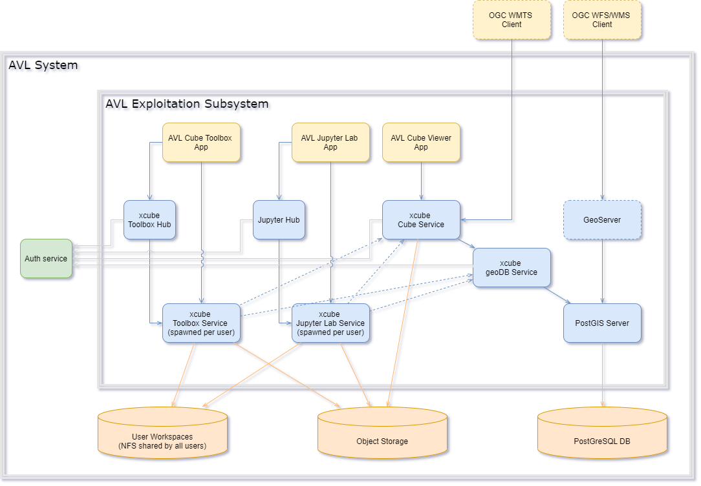
**AVL Exploitation Subsystem**

### AVL Toolbox App

#### General

The AVL Toolbox App is a web application that is used to visualize,
analyse, and process the AVL data cubes from Object Storage, from
users' own workspaces, and from external data sources.

#### Function

The AVL Toolbox App comprises numerous functions for analysis and processing. 
Given here are high-level ones:

-   Browse data stores,

-   Browse datasets from data stores, search datasets, inspect datasets
    details,

-   Open datasets,

-   Browse available (Python) functions, search functions, inspect
    functions details,

-   Apply (Python) functions to datasets or data to generate new
    datasets or other data,

-   Store sequence of applied functions as workflow in the user's
    workspace,

-   Change parameters of a function in the workflow and re-execute,

-   Visualize rich set of different plots (for functions outputting
    figures),

-   Visualize datasets one or more 3D globes,

-   Overlay multiple variables in one view and split views,

-   Display gridded data and vector data,

-   Browse a dataset's variables, inspect variable details,

-   Upload/download data to/from user workspace, browse user workspace.

#### Dependencies

The AVL Toolbox app depends on the AVL Toolbox Hub and the AVL Toolbox
services spawned by the Hub for each logged in user.

#### Interfaces

The AVL Toolbox app is a progressive, single page web application that
runs in any modern browser.

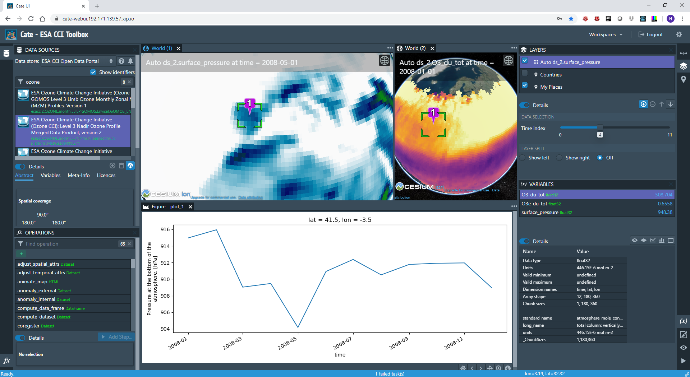
**AVL Cube Toolbox user interface**

AVL Toolbox app is programmed in TypeScript and
is using the popular React, BlueprintJS, and Cesium JavaScript
libraries.

### xcube Toolbox Hub

#### General

The xcube Toolbox Hub is a web service whose main responsibility is
spawning new xcube Toolbox services for each logged-in user. For
authenticated users, the service assigns a workspace directory (user
home directory) and runs a dedicated toolbox service bound to that
workspace.

#### Function

-   Associate workspace directory with user,

-   Spawn new xcube services per user,

-   Auto-shutdown idle user services,

-   Limit concurrent services,

#### Dependencies

The xcube Toolbox Hub depends on the Auth service. It also requires
Kubernetes to spawn and manage xcube Toolbox services.

#### Interfaces

The xcube Toolbox Hub has a dedicated REST API that is used by the xcube
Toolbox App.

### xcube Toolbox Service

#### General

The main purpose of the xcube Toolbox service is to implement and
execute the AVL Toolbox App functionality. It does this on a per-user
basis.

#### Function

The xcube Toolbox service implements the AVL Toolbox App's
functionality:

- List data stores,

- List datasets from data stores, search datasets, provide datasets
  details,

- Open and cache datasets,

- List a dataset's variables, provide variable details,

- List available (Python) functions, search functions, provide
  functions details,

- Invoke (Python) functions to datasets or data to generate new
  datasets or other data,

- Store sequence of applied functions as workflow in the user's
  workspace,

- Execute new and re-execute changed workflows,

- Provide matplotlib backend for plot rendering,

- Provide image tiles for on-the-fly visualization of variables of
  gridded datasets,

- Provide GeoJSON streams for on-the-fly display of vector datasets,

- Provide user workspace management (file upload/download, file tree
  browsing).

#### Dependencies

The xcube Toolbox service depends on the following components:

- User Workspace – to store/load user workflows, analysis results,
  cache datasets,

- Object Storage – to store/load system and user dataset (data cubes
  in Zarr format),

- xcube Cube Service – to ingest the system data cubes as data store

- xcube geoDB Service – to ingest the system vector data sources as
  data store.

#### Interfaces

The xcube Toolbox service API is based on two protocols, a REST API
based on HTTP and a JSON RPC API based on WebSockets.

The REST API provides:

- low level workspace file management like upload, download, deletion,

- the image tiles for the variables of a gridded datasets given its
  colour mapping.

The JSON RPC API does anything else:

- Listing of data stores, datasets, functions,

- Invocation of functions, progress monitoring and cancellation of
  running functions,

- Execution of user workflows, progress monitoring and cancellation of
  running workflows,

- Management of user workflows: new, deletion, adding new functions
  calls, changing function parameterisation.

### AVL Jupyter Lab App

#### General

The AVL Jupyter Lab App is a web application that allows user to create,
execute and manage their Jupyter Notebooks. It is an extended and customized
version of the standard [JupyterLab](https://jupyterlab.readthedocs.io/)
environment, with a slightly branded UI to indicate that it belongs to the AVL
system. The AVL Jupyter Lab App is regarded as the most important part of the
AVL Exploitation system.

#### Function

The standard functionality of the core JupyterLab is well-known and is
described here its extensive
[documentation](https://jupyterlab.readthedocs.io/). The AVL Jupyter Lab uses
a customized Python-based user image which includes a rich set of popular data
science packages, including xarray, geopandas, dask, numpy, scipy, and numba.
Additionally, it incorporates packages which extend the functionality of
JupyterLab itself, including functionality to work with GitHub code 
repositories, visualize GeoJSON data, and explore Dask computation processes.

The AVL JupyterLab app user image also includes the xcube package and any
further functionality required by AVL users. By using xcube, users can

- Ingest datasets from internal data stores:
  - Datasets in AVL Object Storage,
  - Datasets exposed by xcube cube service,
  - Datasets exposed by xcube geoDB service.
- Ingest datasets from various external data stores:
  - Sentinel Hub,
  - ESA CCI,
  - C3S Climate Data Store.
- Display and analyse data cubes.
- Generate new data cubes.
- Rasterize vector datasets.

The AVL JupyterLab user image also provides custom integrations with the
rest of the AVL system, including:

- Predefined, preinitialized data store definitions giving the user instant,
  configuration-free access to the AVL's various object storage buckets.

- Automatic integration of a selection of introductory example notebooks which
  document and demonstrate the features provided by the AVL.

#### Dependencies

The AVL JupyterLab App depends on the Jupyter Hub and the xcube Jupyter
services spawned for individual users. The full AVL data store functionality
also depends on the AVL object storage resources.

#### Interfaces

The AVL Jupyter Lab App uses the well-known graphical JupyterLab user
interface:
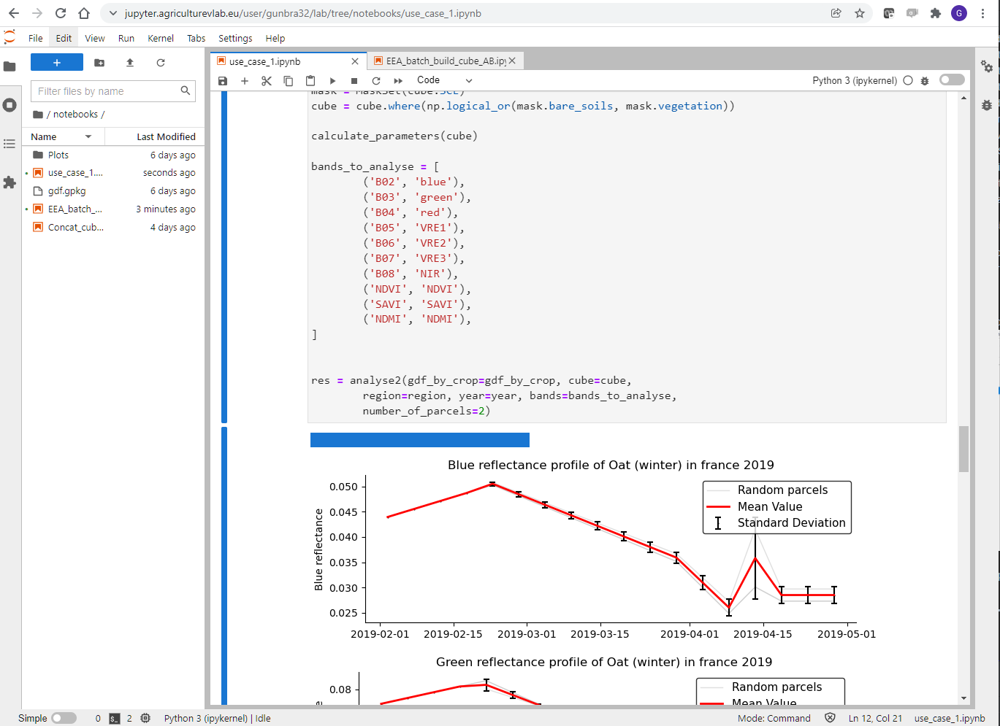
**JupyterLab user interface**

### Jupyter Hub

#### General

A [Jupyter Hub](https://jupyterhub.readthedocs.io/) instance in the AVL
Exploitation system is responsible for spawning xcube Jupyter Lab
services for individual users so they can run their Notebooks.

#### Function

The functionality of the Jupyter Hub is:

- Associate workspace directory with user,
- Spawn new xcube Jupyter services per user,
- Auto-shutdown idle user services,
- Limit concurrent services.

#### Dependencies

The Jupyter Hub depends AVL's common Auth Service. It also depends on
Kubernetes resource management.

#### Interfaces

The Jupyter Hub provides a well-known and -documented REST API.

### xcube Jupyter Service

#### General

This is the service spawned by Jupyter Hub. It is basically the same service
as the standard [Jupyter Notebook](https://jupyter-notebook.readthedocs.io/)
service. However, for AVL, the Python kernels used comprise the xcube
software, dedicated AVL functions and a large set of common data science
packages as described in the AVL Jupyter Lab App component.

#### Function

This is the per-user service that provides the Jupyter Lab backend:

- Launching and running kernels,

- Notebook management,

- Data up- and download.

#### Dependencies

The xcube Jupyter service depends on the following components:

- User Workspace – to store/load user data,

- Object Storage – to store/load system and user datasets (data cubes
  in Zarr format),

- xcube Cube Service – to ingest the system data cubes as data store,

- xcube geoDB Service – to ingest the system vector data sources as
  data store.

#### Interfaces

The xcube Jupyter service uses a well-known REST API and uses WebSockets
for running and managing Notebooks.

### AVL Cube Viewer App

#### General

The AVL Cube Viewer App is a simple and intuitive web application that
is used to browse and visualize the AVL data cubes. It also provides
basic time series analyses. Multiple time series can be easily generated
for points or areas and visualised side-by-side. Points and areas my be
user defined or come from a configured places library (vector data
source).

#### Function

With the AVL Cube Viewer App users can:

- Browse available data cubes,
- Display detailed data cube information,
- Select cube variable and display it on the map,
- Change variable colour mapping (colour bars and value range),
- Browse associated place groups and places,
- Draw user defined places such as points, circles, polygons,
- Select place group and draw it on the map,
- Select place and generate time series,
- Display multiple time-series plots side by side.

#### Dependencies

AVL Cube Viewer App solely depends on xcube Cube Service.

#### Interfaces

The AVL Cube Viewer App is a progressive, single page web application
that runs in any modern browser.

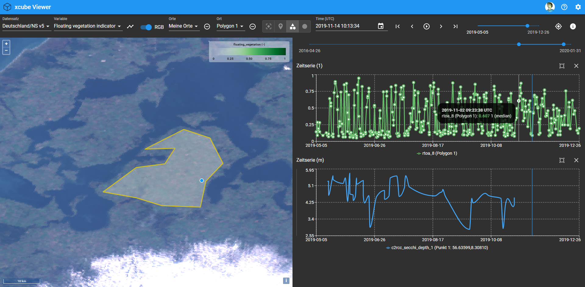
**AVL Cube Viewer App user interface**

User wishing to use or extend the app must use its source code and
recompile it. The app is programmed in TypeScript and is using the
popular React, Material UI, and OpenLayers JavaScript libraries.

### xcube Cube Service

#### General

The main purpose of the xcube Cube Service is to publish the AVL
data cubes through a dedicated REST API. This is used by the AVL Cube
Viewer App but may also be used by other AVL services such as the AVL
Toolbox services and the xcube Jupyter service. The xcube Cube Service
also publishes configured vector datasets ("place groups") that are
associated with the data cubes.

#### Function

The functions of the xcube Data Service are:

- Data cube catalogue:

    - List AVL data cubes from Object Storage,

    - Provide detailed data cube information.

- Image tiles:

    - Provide tiles for RGB images for one or more variables of a data
      cube,

    - Provide tiles for colour-mapped images for a variable of a data
      cube.

- Vector data:

    - List configured place groups, e.g., from xcube geoDB Service,

    - Provide places of given place group as GeoJSON.

- Time series:

    - Aggregate data variables for given place,

    - Extract time series for given place.

#### Dependencies

The xcube Cube Service depends on the

- Auth Service – to authenticate the user and authorize users for the
  API,

- Object Storage – to ingest data cubes publish them as data store,

- xcube geoDB Service – to ingest vector data and publish them as
  data store.

#### Interfaces

The xcube Cube Service uses a REST API that comprises API operations for
all the functions described above.

The image tile provision API is compatible with the [OGC Web Map Tile
Service](https://www.ogc.org/standards/wmts) (WMTS).

The dataset catalogue API is not yet but will be made compatible with
the [STAC specification](https://stacspec.org/).

### xcube geoDB Service

#### General

The xcube geoDB service provides operations to manage geo-spatial
collections comprising features – a set of properties associated with
geo-spatial geometry. Users can query, create, modify, and delete
collections and features.

#### Function

- Query collections,
- Create, modify, and delete collections,
- Share collections with other users,
- Query features,
- Add/change/remove features to/in/from collection.

#### Dependencies

The xcube geoDB Service depends on the PostGres database service.

#### Interfaces

The xcube geoDB Service provides a dedicated REST API that fully covers
the functionality described above.

The xcube geoDB Service also has a Python client that wraps the REST API
so its functionality can be used from Jupyter Notebooks.

### GeoServer

#### General

The [GeoServer](http://geoserver.org/) service is optional and may be
added to add an OGC layer on top of the geo-spatial AVL collections
stored in the PostGres DB and managed by the xcube geoDB Service. With
GeoServer, the AVL collections can be easily exposed via OGC WFS and
WMS.

#### Function

The GeoServer capabilities are well-known and -documented. The
functionality exploited here would be:

- Expose AVL collections via OGC WFS,
- Expose AVL collections via OGC WMS,
- View AVL collections in GeoServers own map viewer.

#### Dependencies

The GeoServer would depend on the Auth service and the PostGre database.

#### Interfaces

OGC WFS and OGC WMS.

## Interfaces Context

### Local Data Sources

Even if the local data source (comprising in the local database and file
system) is not an external interface, it is important to lay out its
organization before describing the external interfaces of the system.

As it can be seen in the below Figure, the local data source consists of a
product database, in which metadata associated with concrete data
products are stored, and a local (network) file system, in which the
data products are physically stored.

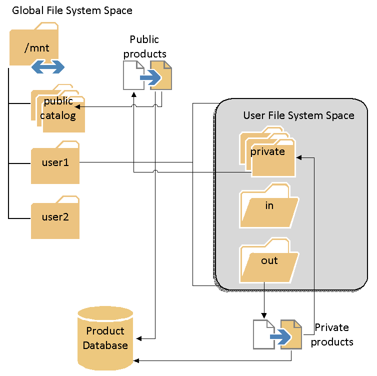
**Local data (product) source**

The product database stores basic metadata about the EO products, such
as acquisition date, geographical footprint, product type, etc.

This metadata allows the users to query the local data source for
products satisfying certain criteria and is created when either products
are initially imported, or new products are downloaded from remote data
sources.

The file system is organized such that an easier distinction can be made
between public products (products that are visible/usable by all users)
and private products (products visible/usable only by a specific user).
This separation further allows the implementation of user quota
management.

The visibility of the products will be implemented at a logical level
(i.e., not by physical operating system rights) in the database.

The file system structure depicted above will be visible to (i.e.,
shared with) all the processing nodes in the AVL cluster. This is
necessary in order to allow a uniform way of accessing products by
processing components from remote nodes.

### Interfaces with External Data Sources

Beyond the product collection that the users may already have, there may
be cases when additional EO data should be used for accomplishing the
user goals. This is where the external data source components intervene.
Like the local data source described in the previous paragraph, the
purpose of an external data source component is to query an EO data
provider and retrieve one or more data products satisfying certain user
criteria.

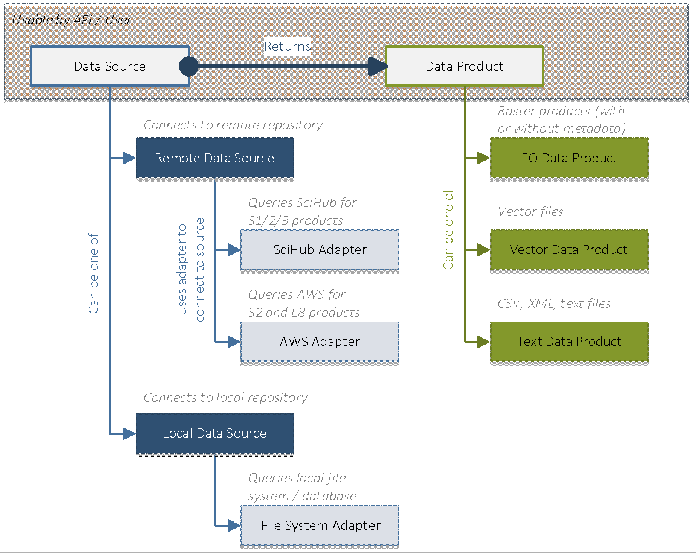
**Types of data sources**

The two types of data sources share the same interface, for the TAO API
the location of the data being transparent. It is the implementation of
the data source that takes care of properly connecting to the remote
repository and querying and retrieving the data products.

The data source interface should expose operations (i.e., methods)
allowing to:

- Connect to the remote repository,
- Authenticate to the remote repository,
- Create a query to be executed against the repository.

Given the diversity of EO products (and product providers), the
parameters of a query may be bound to a specific repository.
Nevertheless, a preliminary analysis revealed that there is a small
subset of parameters that are supported by different providers, namely:

- The product name or identifier,
- The acquisition date (and time),
- The product footprint.

Besides these parameters, various providers may exhibit different
parameters (even if a parameter would conceptually represent the same
measure, two providers may have different notations for it). In order to
cope with this diversity, the query shall allow for name-value
collections of parameters that will be described for each data source.
This allows adding (or describing) new data sources without any impact
(or change) of the object and relational model.

The next figure illustrates the above attributes and features of the
data source and data query components:

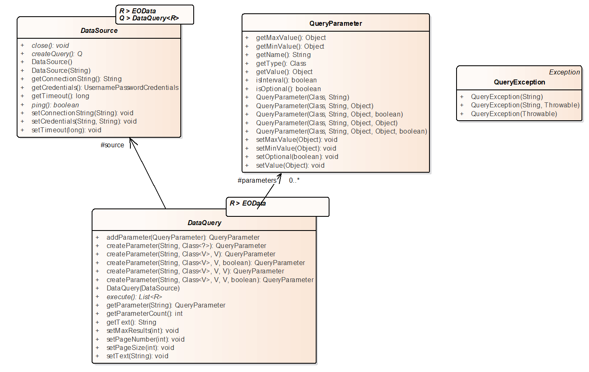
**Generic data source and data query interfaces**

For the purpose of the AVL platform prototype, the external EO data
providers used are based on the agreed selection from the list
contained in RD.3.

### Interfaces for External System Access

A closed platform is of limited use and impales its adoption by the
community. Therefore, the AVL platform allows for the
interoperation with external systems, and for a standardized access by
external clients. In order to accomplish that, it will rely on an
OGC-compliant interface.

### Interface with Cloud Computing Infrastructure

#### TAO

In order to decouple the core of the TAO framework from the actual
Cluster Resource Manager implementation, the latter component will have
a DRMAA-compliant interface.

The DRMAA provides a standardized access to the DRM systems for
execution resources. It is focused on job submission, job control,
reservation management, and retrieval of jobs and machine monitoring
information.

Currently, TAO supports several DRMAA implementations, presented in the
next table:

  | DRMAA Implementation Language | DRM System |
  |-------------------------------|------------|
  | C                             | PBS/Torque |
  | C                             | SLURM      |
  | Java                          | TAO-SSH    |
  | Java                          | Kubernetes |

**List of existing DRMAA implementations**

The approach adopted by the TAO framework will allow for
easily swapping such implementations, making the framework loosely coupled
from the actual DRM system used.

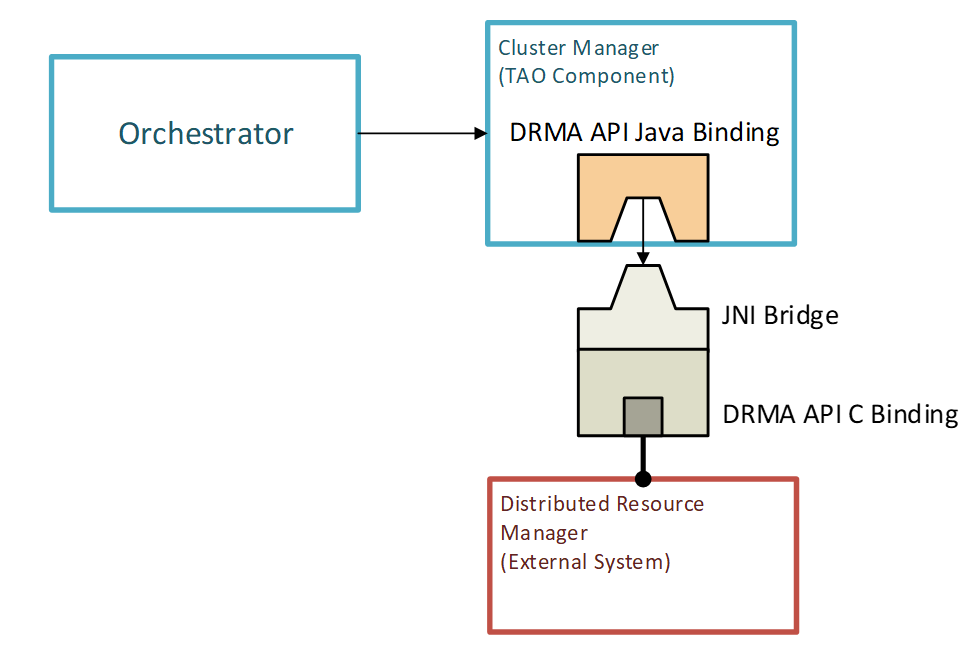
**TAO Integration of a DRM system**

The swap of DRM bridge implementations is possible by the usage the Java
Service Provider Interface (SPI).

The dynamic allocation of computing resources (virtual machines) is done
via the OpenStack Nova API. OpenStack is a cloud resources management
software currently in use in most of the cloud providers. It exposes
many APIs, the Nova subset being the computing-related API. TAO has a
dedicated module that makes use of this API.

#### xcube

All services proposed here will be run and orchestrated by a **Kubernetes
(K8s) Engine** operating in the cloud environment. Cube computations are
performed on a dedicated cluster using containerised xcube AVL Runtime. The
compute power for the distributed chunk computations comes from a dedicated
**Dask cluster** that is also maintained and scaled through K8s. The following
diagram resembles what has been said above:

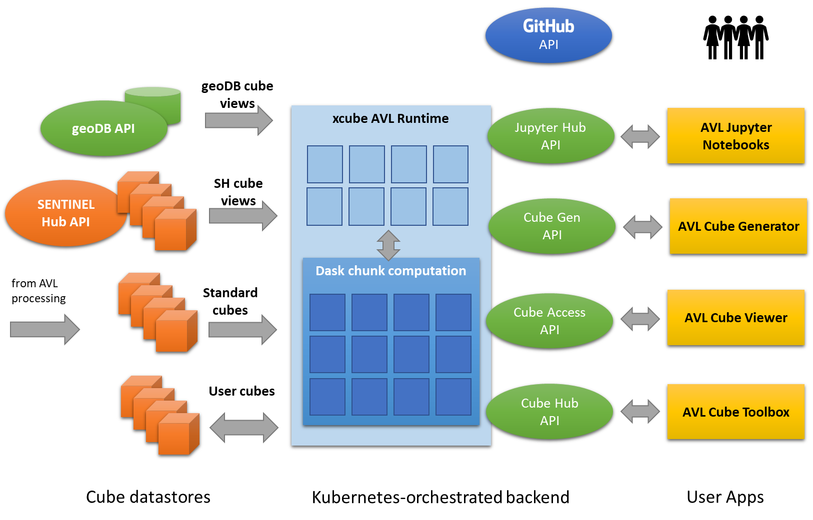
**Concurrent computations in the AVL Exploitation subsystem**

# Long Lifetime Software

AVL uses the following software resources:

| Software resource           | Minimal Version | Reference                                                                                   |
|-----------------------------|-----------------|---------------------------------------------------------------------------------------------|
| Spring Framework            | 5.2.0 .RELEASE  | [link](https://spring.io)                                                                   |
| Java SE                     | 8u131           | [link](http://www.oracle.com/technetwork/java/javase/downloads/jdk8-downloads-2133151.html) 
| PostgreSQL                  | 11              | [link](https://www.postgresql.org/)                                                         |    
| Docker Community Edition    | 17.03           | [link](https://www.docker.com)                                                              |                                                                                            |
| HTML5                       | | [link](https://www.w3.org/TR/html5)                                                         |
| jsPlumb Community   Edition | 2.4.2 | [link](https://jsplumbtoolkit.com)                                                          |                                                                                   |
| jQuery                      | 3.2.1    | [link](https://jquery.com)                                                                  |
| Orfeo Toolbox               | 7.2.0    | [link](https://www.orfeo-toolbox.org)                                                       |
| SNAP         | 8.0.0    | [link](https://step.esa.int)                                                                |
| GDAL         | 3.2.0    | [link](https://gdal.org)                                                                    |

**AVL software resources**

The target operating system for AVL shall be Ubuntu 20.04.
