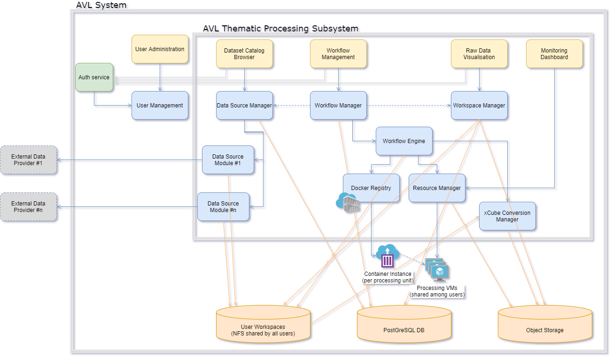

# Thematic processing system design

The thematic processing sub-system is a collection of self-contained (i.e.,
packed in Docker containers) applications or systems, that produce value-added
EO products (such as crop masks, crop types, agricultural practices, etc.).

The sub-system has at its core the TAO Workflow and Integration engine. TAO
(stands for Tool Augmentation by user enhancements and Orchestration) is an
open-source (under GPLv3 license) lightweight, generic integration, and
distributed orchestration framework. It allows the integration of commonly
used toolboxes (such as, but not limited to, **SNAP, Orfeo Toolbox, GDAL,**
etc.) into a single user environment. This framework allows for processing
composition and distribution in such a way that end users could define by
themselves processing workflows and easily integrate additional processing
modules (either standalone executables or Python or R scripts).

In terms of use, the TAO platform provides a means for orchestration of
heterogeneous processing components and libraries to process remote sensing
data. This is achieved in following steps:

- Preparation of resources (including processing components) and data input,

- Definition of a workflow as a processing chain,

- Execution of workflows,

- Retrieval / visualisation / sharing of the results.

The following diagram details the AVL Thematic Processing subsystem
whose components are described hereafter:

**AVL thematic subsystem**

## System Monitoring Dashboard

### General

The System Monitoring component (and dashboard) provides real-time
information about system activities and system resource usage.

### Function

The dashboard monitoring related functions are:

- view the currently used system resources (CPU, memory, time) – accessible
  for both administrator and user roles, with the difference that the user can
  only view the resources used by his running jobs,

- view job execution details – accessible for both administrator and user
  roles, with the difference that the user can only view his jobs execution
  details,

- view jobs execution status – accessible for both administrator and user
  roles, with the difference that the user can only view his jobs execution
  status,

- view user quota status – accessible for both administrator and user roles,
  with the difference that the user can only view his quota status,

- view the platform statistics – accessible only for AVL administrators.

### Dependencies

The module depends on the Thematic Workflow Engine and Data Cube Processing
Engine for activity monitoring.

### Interfaces

The module exposes a Java API (for integration with other Java components) and
a REST API (for usage from heterogeneous clients, including web clients).

## User Workspace Manager

### General

The purpose of the User Workspace Manager component is twofold: it ensures the
privacy of users (their data is protected from other users) and it allows
quota management (the quantity of infrastructure resources – such as storage,
CPU, memory – a user can use).

### Function

The following functions are performed by this component:

- View the details about local data products (accessible for both
  administrator and user roles, with the difference that the user can only
  view details about his local data products as well as public data products),

- Upload additional files that can be further used in workflows (such as model
  files, shape files, etc.),

- Publish (share) data products with other users,

- Monitor user quota.

Note: The AVL Toolbox Hub includes its own workspace management. It is,
however, dependent on the same User Workspace NFS share. For users of the AVL
system, this will be transparent.

### Dependencies

The workspace manager depends on the User Workspace NFS shares common
component.

### Interfaces

The module exposes a Java API (for integration with other Java components) and
a REST API (for usage from heterogeneous clients, including web clients).

Note: The AVL Toolbox service exposes an API (WebSocket-based JSON RPC)
to let users manage just *their* private workspace.

## Thematic Workflow Engine

### General

The Thematic Workflow Engine is in charge of execution of workflows by
creating and handling jobs and performing the management of the execution
steps from a workflow. The purpose of the Orchestration is to allow the
execution of a workflow, by creating a job for each workflow execution,
splitting and managing the internal components of the workflow in execution
tasks.

### Function

The main functionalities realized by this component are:

-   Parse the Workflow definition and extract the tasks to be executed,

-   Handle the parameters to be used in each processing component (mapped to a
    task),

-   Upon reception of a new workflow execution request, creates a new
    execution job in the database and its execution tasks, corresponding to
    the workflow components,

-   Determines the tasks to be executed at a given moment of time and submit
    them to the corresponding executor,

-   Monitors the execution statuses of the tasks in order to decide the next
    actions to be performed,

-   Manages the job operations requests like pause, cancel or resume,

-   Marks the jobs executions as finished or failed, according to the task
    execution results.

The component comprises several constituents:

#### Orchestrator

This is the component that performs the functionalities above. It uses the
ExecutionsManager that undertakes the tasks executions, according to the mode
in which the platform is configured. In this architecture, the Orchestrator is
in charge with the workflow steps extraction and decide the next steps to be
executed from the workflow while the executor is in charge with the effective
execution and monitoring the execution statuses of the current executing
tasks.

#### ExecutionsManager

The ExecutionsManager is in charge of executions of the tasks that the
Orchestrator needs to perform during a workflow execution. It implements the
following functions:

-   Prepares the parameters of the execution via an ExecutionAdapter and will
    send the new task command line to be executed to the Cluster Manager,

-   Determines the node where the execution should be performed depending on
    the nodes configured for the executed processing component (or creates a
    new one),

-   Monitors and eventually receives notifications about the changes in the
    execution status of the current executing tasks (task pending for start,
    running, finished, cancelled) and saves them into the database,

-   Monitors and eventually receives the logs generated by the processing
    component (progress messages or error messages) and saves them in the
    database for the current task. In this manner, the AVL GUI will have the
    possibility to display to the user the task messages in near-real-time or
    at the end of the execution,

-   Can request to the ExecutionsManager to cancel, pause or resume the
    execution of a task,

-   Upon the finalization of the execution of a task, the ExecutionsManager is
    also in charge to insert into the database the metadata of the resulted
    output products (if they were configured in such manner).

Upon the execution of a task, the ExecutionsManager performs the following
operations:

-   Before starting the execution, the ExecutionsManager creates the command
    line to be executed for the processing component considering the
    descriptor of the processing component and the provided parameters values
    to be used for execution. Some of the values are provided by the
    orchestrator that determined the outputs (if it is the case) of the
    previous task(s) to be used as inputs for the current execution.

-   The ExecutionsManager then checks, in the case of a distributed
    configuration, the load and the limitations set for the nodes where the
    component needs to be executed and filters, if necessary, the machines
    where to execute the task along with the memory or CPU limitations,

-   Once a task is submitted for execution, the ExecutionsManager marks the
    task in the database as SUBMITTED. After tasks submission, the
    ExecutionsManager will be in charge to monitor the status of the currently
    executing jobs and to notify the Orchestrator about the changes in the
    execution state of a certain task. The monitoring operation is performed
    by requesting periodically to the Cluster Manager information about the
    job statuses. The DRMAA specifications also provide the possibility to
    receive callback notification about Cluster Manager job execution state
    changes but this depends on the DRMAA implementation for that specific
    Cluster Manager (for example, changing the cluster manager from Torque to
    Slurm might show that the callback notifications are not supported by the
    DRMAA implementation for Slurm). The changes detected by the
    ExecutionsManager in the state of an executing task (if the execution was
    started if it is still in the pending state of if it finished) are marked
    in the database as events that can be read by the Orchestrator but also
    that can be read by the IHM in order to present the current execution
    state of the tasks.

-   During the execution of a task, it is necessary to also extract the log
    messages (progress, debug, errors etc.) of the processing component
    execution. The ExecutionsManager will be also in charge to retrieve
    periodically the log messages of the execution tasks that are currently in
    the RUNNING state. This will be also performed by polling, using the API
    of the Cluster Manager for getting the messages (for example, qpeek, in
    case of Torque) that are displayed in real time to the user, in the IHM.
    At the end of the execution of a task, the ExecutionsManager will
    retrieve, if necessary, the full log file and will make it available to
    the user.

#### Executor

The Executor component is used to execute the tasks' command lines via the
DRMAA interface. It provides the API for:

-   Start the execution of the processing components using the specified
    command line,

-   Stop/suspend or resume the execution of the processing components,

-   Provide information about the progress of the execution and logs,

-   Specific functions from DRMAA specifications,

-   Custom functions demanded by the AVL platform (listeners, initialization
    functions etc.).

Although there are several implementations already available in the TAO
framework, AVL will use one of the following two implementations:

-   A process executor using SSH,

-   A Kubernetes executor.

### Dependencies

The Orchestrator depends on the following components:

-   The Persistence Manager – for saving execution information like
    logs and task states into the database,

-   The Cluster Manager – for executing the job tasks.

### Interfaces

The module exposes a Java API (for integration with other Java components) and
a REST API (for usage from heterogeneous clients, including web clients).

### Data

The data that the Thematic Workflow Engine is handling are:

-   Parameters of the execution (including information about the products and
    the actual product files that are used in the execution),

-   Description of the processing component that defines the inputs, the
    outputs and their types, the type of the processing component (either a
    script or a WPS server),

-   The progress, log and error messages,

-   Configuration of the nodes where the execution takes place.

## Thematic Workflow Management

### General

The Workflow Management component contains the implementation for workflow
management for the thematic processing subsystem. The purpose of the Workflow
Management component is to allow processing and pre-processing workflows
parametrization for chaining multiple operators on input satellite products.

### Function

The main functionalities exposed by this component are:

-   retrieve the list of workflows that a given user can see,

-   clone an existing workflow,

-   parameterize a workflow according to the user needs,

-   create a workflow from existing toolboxes,

-   validate a workflow,

-   publish a workflow.

### Dependencies

The Workflow Management component uses the Persistence Manager component
for saving and updating the workflow related data into the AVL database.

### Interfaces

The module exposes a Java API (for integration with other Java components) and
a REST API (for usage from heterogeneous clients, including web clients).

### Data

The data handled by this component are the workflow details (name, definition,
identifier, visibility flag, etc.), which can be saved/retrieved into/from the
AVL database using Persistence Manager.

## Data Sources Manager

### General

The Data Sources Manager component handles the external data source modules in
the AVL platform. The purpose of the Data Sources Manager component is to
allow data sources visualization and configuration for their usage in
workflows creations.

### Function

The main functionalities exposed by the component are:

-   retrieve all existing data sources visible by a given user,

-   retrieve the parameters of a data source,

-   update the parameters of a data source,

-   query the remote data source,

-   retrieve data products

-   retrieve the parameters of a data source,

-   save a user data product (resulting from a data source interrogation
    or privately owned).

### Dependencies

The Data Sources Manager component uses the Persistence Manager component for
saving and updating the data sources and data products related data into the
AVL database. It also depends on the data source plugins that are installed in
the platform.

### Interfaces

The module exposes a Java API (for integration with other Java components) and
a REST API (for usage from heterogeneous clients, including web clients).

### Data

The data handled by this component are the data sources details (name,
type, description, connection details and other parameters, etc.), which
can be saved/retrieved into/from the AVL database using the Persistence
Manager.

## xcube Converter Manager

### General

The xcube Converter Manager handles the format conversion from original raster
product formats (specific to external data providers or to thematic processing
subsystem components) to Zarr format (specific to data cubes).

### Function

The module manages individual converters from:

-   formats specific to external data providers,

-   formats specific to processing subsystem components (such as
    Sen2Agri, etc.)

### Dependencies

The xcube Converter Manager depends on Workspace Management for
retrieving the data products and writing data cubes.

### Interfaces

The module exposes a Java API (for integration with other Java
components)

## Dataset Catalogue Browser

### General

The purpose of the Dataset Catalogue Browser is to expose to users the
datasets (local or remote) that are available for usage in AVL.

### Function

The Dataset Catalogue Browser allows for:

- Listing the available data providers,

- Listing the available data sets for each provider,

- Searching for specific data products in a uniform way (different
  providers may have different filters for searching data),

- Retrieving the selection of data products to the user workspace.

### Dependencies

The module relies on the Data Sources Manager component for listing the
available data providers and searching and/or fetching the data
products.

### Interfaces

The module has a web interface with different pages for listing the
available data providers and for searching and retrieving data products:

**TAO Data Provider List**

**TAO Data Products Search**

These interfaces will be modified to better suit the AVL needs and to
accommodate the overall AVL UI look and feel.

## Dataset Explorer

The Dataset Explorer allows for:

-   Listing the available data providers,

-   Listing the available data sets for each provider,

-   Searching for specific data products in a uniform way (different providers
    may have different filters for searching data),

-   Retrieving the selection of data products to the user workspace.

## Workflow Editor

The Workflow Editor allows for building custom processing chains using modules
from the supported toolboxes. Main functionalities are:

-   retrieve the list of workflows that a given user can see,

-   clone an existing workflow,

-   parameterize a workflow according to the user needs,

-   create a workflow from existing toolboxes,

-   validate a workflow

## Authentication and Authorization

### General

The Authentication and Authorization component contains the
implementation for user access to the AVL platform, secures user access
to the application, and manages user permissions to different parts of
the platform.

### Function

The Authentication and Authorization component provides an interface
that is implemented by the authentication specific mechanism, so
that this mechanism can be changed or decoupled from the interface.
Also, there is an authorization interface which is implemented by the
authorization mechanism providing the user authorization through the
system.

### Dependencies

Every graphical user interface module that calls backend business logic
needs to authenticate in order to have access to the desired data.
The Authentication and Authorization component uses encryption and
hashing mechanisms. It also uses the Persistence Manager component
for database users and permissions management.

### Interfaces

The main interfaces in term of data flow of this component are:

-   As inputs:
    -   The username and password for login,
    -   The user password for password reset.
-   As outputs:
    -   The login action result (successful or not),
    -   The password reset action result (successful or not).

### Data

The data handled by this component are the user's credentials and rights,
which, depending on the authentication mechanism, can be retrieved from the
AVL database using Persistence Manager or from an external authentication and
authorization user management system. The service also provides API access
tokens to authenticated clients, which are then used by a service to authorise
internal and external access.

### Remarks

AVL uses the [*Keycloak*](https://www.keycloak.org/) software for simplifying,
but also to increase the spectrum of, the authentication mechanism. Keycloak
adds authentication to applications and secures services with minimum work. It
supports, among others, user federation, identity brokering and social login.

## User Management

### General

The User Management component contains the implementation for user management
in the AVL platform. The purpose of the User Management component is to define
the users allowed to use the platform, and to define their quota in terms of
storage and computing resources (CPU, memory).

### Function

The User Management component provides an interface so that all other
components interacting with the user management will use the functionalities
exposed by it. The main functionalities of the component are:

-   add a new user by providing a username and an email address,

-   update user credentials (by setting password provided by user after
    account activation),

-   set and update user quota,

-   remove/deactivate a user.

### Dependencies

The User Management component uses the Persistence Manager component for
storing user details in the AVL database.

### Interfaces

The module exposes a Java API (for integration with other Java
components) and a REST API (for usage from heterogeneous clients,
including web clients).

### Data

The data handled by this component are the user details (credentials and
quota), which can be saved/retrieved into/from the AVL database using
Persistence Manager.

