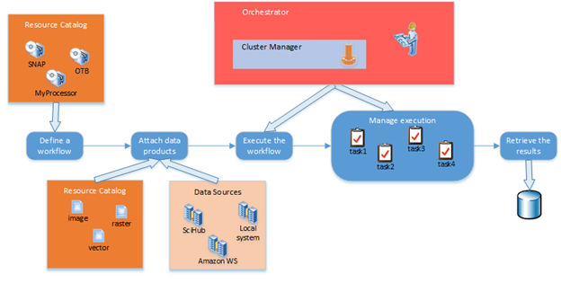

## Platform design

This section contains a description of the TAO platform from
architectural point of view.

The logical data flow of the TAO platform is provided in the next
figure:

Logical data flow of the TAO platform

From logical data flow point of view we can distinguish the components:

-   *Resource Catalog* - the repository from where the user can select
    'processing components' (e.g. modules from SNAP, OTB, etc.) and
    'data products' as input data for processing workflow. The access to
    'data products' is provided via 'data sources' which represents an
    abstractization of a way to connect to a live set of data.
    Physically, the files that make up a 'data product' can be accessed
    locally (local file system) or remotely through the web services
    provided by known cloud platforms (SciHub, Amazon WS).

-   *Orchestrator* - play the role to decompose a workflow job into
    tasks and to send them for execution to the Cluster Manager that
    distribute their execution over the eligible nodes.

-   *Cluster Manager* - coordinate the tasks execution in a distributed
    way and manage the processing resources.

## Platform use cases

There are two user roles, playing as:

-   Public User - type of user who exploit the TAO platform
    functionalities

-   Administrator - type of user in charge with platform configuration
    and administration

## Platform interfaces

The platform is interfacing with:

-   *Data products* - through data sources, all internal parts of a data
    product (images themselves, description files with metadata) can be
    read and interpreted

-   *Rendering system* - for displaying the input data products and also
    the final results the GeoStorm system has been chosen

-   *External processing platforms* - the communication with external
    processing platforms is made using the WPS protocol implemented as
    client (for making connection to other systems) as well as server
    (to accept connections from other systems)

# Software validation and verification plan

## Synthesis of requirements

The V&V activities are targeting the requirements found in the table
below:

<table>
<colgroup>
<col style="width: 15%" />
<col style="width: 72%" />
<col style="width: 12%" />
</colgroup>
<thead>
<tr class="header">
<th><strong>ID</strong></th>
<th><strong>Requirement</strong></th>
<th>
<strong>Validation/</strong>

<strong>Verification method</strong>
</th>
</tr>
</thead>
<tbody>
<tr class="odd">
<td colspan="3">Functional requirements</td>
</tr>
<tr class="even">
<td colspan="3"><blockquote>

Resource Administration [core]

</blockquote></td>
</tr>
<tr class="odd">
<td>RQ-RAD-01</td>
<td>It shall be possible for the user (Administrator or Public User) to
add, edit or delete resources into system.</td>
<td>Test</td>
</tr>
<tr class="even">
<td>RQ-RAD-02</td>
<td>A resource can be deleted from system if there is no reference to
it.</td>
<td>Test</td>
</tr>
<tr class="odd">
<td>RQ-RAD-03</td>
<td>Resources added by Administrator can be used by all users.</td>
<td>Test</td>
</tr>
<tr class="even">
<td>RQ-RAD-04</td>
<td>The flush operation of a node should offer the possibility to move
the entire execution environment to another eligible node.</td>
<td>Test</td>
</tr>
<tr class="odd">
<td colspan="2"><blockquote>

User Workspace [core]

</blockquote></td>
<td></td>
</tr>
<tr class="even">
<td>RQ-UWS-01</td>
<td>The WM shall allow the definition and management of workflows.</td>
<td>Test</td>
</tr>
<tr class="odd">
<td>RQ-UWS-02</td>
<td>The WM shall allow the link between two components only if the
output of one component matches the input requirements of the other
component.</td>
<td>Test</td>
</tr>
<tr class="even">
<td>RQ-UWS-03</td>
<td>The WM shall be able to convert the drawn workflows into jobs to be
executed.</td>
<td>Test</td>
</tr>
<tr class="odd">
<td>RQ-UWS-04</td>
<td>The WM shall be able to find the eligible nodes for the
corresponding tasks within a workflow.</td>
<td>Test</td>
</tr>
<tr class="even">
<td>RQ-UWS-05</td>
<td>The WM shall be able to find the eligible nodes for the
corresponding tasks within a workflow.</td>
<td>Test</td>
</tr>
<tr class="odd">
<td colspan="2"><blockquote>

Processing Component Integration [core]

</blockquote></td>
<td></td>
</tr>
<tr class="even">
<td>RQ-PCI-01</td>
<td>The framework shall be able to integrate processing components (i.e.
executables) written in different programming languages.</td>
<td>Analysis</td>
</tr>
<tr class="odd">
<td>RQ-PCI-02</td>
<td>The framework shall integrate at the same time processing components
written for only one targeted operating system.</td>
<td>Analysis</td>
</tr>
<tr class="even">
<td>RQ-PCI-03</td>
<td>Processing components shall be exposed to the framework in the same
way (i.e. a single interface), regardless of the programming language in
which they were written.</td>
<td>Inspection</td>
</tr>
<tr class="odd">
<td>RQ-PCI-04</td>
<td>The wrapping interface for a processing component shall be able to
pass to the processing module the input from the workflow context.</td>
<td>Test</td>
</tr>
<tr class="even">
<td>RQ-PCI-05</td>
<td>The wrapping interface for a processing component shall be able to
invoke the processing module with the appropriate parameters.</td>
<td>Test</td>
</tr>
<tr class="odd">
<td>RQ-PCI-06</td>
<td>The wrapping interface for a processing component shall be able to
report the execution progress and status back to the workflow
manager.</td>
<td>Test</td>
</tr>
<tr class="even">
<td>RQ-PCI-07</td>
<td>The wrapping interface for a processing component shall be able to
integrate the results of the processing component back into the parent
workflow.</td>
<td>Test</td>
</tr>
<tr class="odd">
<td>RQ-PCI-08</td>
<td>The framework shall provide to each integrated processing component
the appropriate set of runtime dependencies.</td>
<td>Inspection</td>
</tr>
<tr class="even">
<td>RQ-PCI-09</td>
<td>Processing components executing on the same processing node (i.e.
machine) shall have not interfere with each other and shall be executed
inside dedicated containers.</td>
<td>Analysis</td>
</tr>
<tr class="odd">
<td>RQ-PCI-10</td>
<td>If multiple processing components (i.e. belonging to the same
toolbox) share the same runtime dependencies, they shall be executed
inside the same execution container.</td>
<td>Analysis</td>
</tr>
<tr class="even">
<td colspan="2"><blockquote>

Data Access [core]

</blockquote></td>
<td></td>
</tr>
<tr class="odd">
<td>RQ-DAC-01</td>
<td>The framework shall allow for retrieving EO and ancillary data from
both local and remote repositories.</td>
<td>Test</td>
</tr>
<tr class="even">
<td>RQ-DAC-02</td>
<td>A local data repository shall consist in a combination of a database
and file system. Metadata (i.e. data descriptors) shall be stored in the
database, while data themselves shall be stored in file system.</td>
<td>Analysis</td>
</tr>
<tr class="odd">
<td>RQ-DAC-03</td>
<td>The framework shall abstract the source of data and the data. All
registered data sources shall be queried in the same way and they shall
produce compatible results.</td>
<td>Inspection</td>
</tr>
<tr class="even">
<td>RQ-DAC-04</td>
<td>A data source component shall allow the API or the user to provide
credentials needed to connect to a repository.</td>
<td>Inspection</td>
</tr>
<tr class="odd">
<td>RQ-DAC-05</td>
<td>A data source component shall allow queries that return one or more
EO data products.</td>
<td>Inspection</td>
</tr>
<tr class="even">
<td>RQ-DAC-06</td>
<td>A remote data source component shall take into account the users
quotas before actually retrieving remote products.</td>
<td>Test</td>
</tr>
<tr class="odd">
<td>RQ-DAC-07</td>
<td>A data source component shall allow specifying if the returned
results shall be accessible only by the calling API or user, or they
shall be available to all the users of the framework instance.</td>
<td>Test</td>
</tr>
<tr class="even">
<td>RQ-DAC-08</td>
<td>The framework shall provide as default several data sources for
radar and optical data. The data products returned by these sources will
be accessible by all users of the framework instance.</td>
<td>Analysis</td>
</tr>
<tr class="odd">
<td>RQ-DAC-09</td>
<td>The local data repository can support retention policies.</td>
<td>Analysis</td>
</tr>
<tr class="even">
<td colspan="2"><blockquote>

Workflow Execution Management [core]

</blockquote></td>
<td></td>
</tr>
<tr class="odd">
<td>RQ-WEM-01</td>
<td>The WEM shall be able to manage the execution of workflows as
produced by the Workflow Management feature.</td>
<td>Analysis</td>
</tr>
<tr class="even">
<td>RQ-WEM-02</td>
<td>The WEM shall be able to execute a workflow, to return the execution
status of any running processing module (component) involved in a
workflow and to allow the return of results (if persisted).</td>
<td>Test</td>
</tr>
<tr class="odd">
<td>RQ-WEM-03</td>
<td>The WEM shall be able to monitor the execution of all workflow
jobs.</td>
<td>Test</td>
</tr>
<tr class="even">
<td>RQ-WEM-04</td>
<td>The WEM can support custom allocation of resources, in terms of
memory, CPU, disk or network, for a given execution.</td>
<td>Analysis</td>
</tr>
<tr class="odd">
<td>RQ-WEM-05</td>
<td>The WEM can support the reservation of resources into a node, in
terms of memory, CPU, disk or network, for a given execution, dedicated
to a given user.</td>
<td>Analysis</td>
</tr>
<tr class="even">
<td>RQ-WEM-06</td>
<td>The WEM should support an interface to provide status and usage
information to the other components via a given API.</td>
<td>Inspection</td>
</tr>
<tr class="odd">
<td>RQ-WEM-07</td>
<td>The WEM should be able to block a task execution on request from the
Administrator and release the reserved resources.</td>
<td>Test</td>
</tr>
<tr class="even">
<td>RQ-WEM-08</td>
<td>The WEM can be able to pause activity job execution on request of
the user, releasing partially or totally the reserved resources, and
then resume it later.</td>
<td>Test</td>
</tr>
<tr class="odd">
<td colspan="2"><blockquote>

Resource Management [additional]

</blockquote></td>
<td></td>
</tr>
<tr class="even">
<td>RQa-RMG-01</td>
<td>The platform shall provide a catalog component.</td>
<td>Analysis</td>
</tr>
<tr class="odd">
<td>RQa-RMG-02</td>
<td>The catalog component shall respect standards such as CWS,
OpenSearch, ISO 119115, WCS.</td>
<td>Review</td>
</tr>
<tr class="even">
<td>RQa-RMG-03</td>
<td>The catalog component should reference information from external
data provider.</td>
<td>Inspection</td>
</tr>
<tr class="odd">
<td>RQa-RMG-04</td>
<td>The catalog component should harvest data (at least metadata) from
external data provider.</td>
<td>Inspection</td>
</tr>
<tr class="even">
<td>RQa-RMG-05</td>
<td>The platform shall authenticates users before allowing access to its
services and data.</td>
<td>Test</td>
</tr>
<tr class="odd">
<td>RQa-RMG-06</td>
<td>The platform shall allow setting authorizations to users, groups on
access to services and data.</td>
<td>Test</td>
</tr>
<tr class="even">
<td>RQa-RMG-07</td>
<td>Authenticated users can only access services and data they have
authorizations to use.</td>
<td>Test</td>
</tr>
<tr class="odd">
<td>RQa-RMG-08</td>
<td>The platform shall be able to limit access to its services
(processing, disk space, etc.) accordingly to the quota set by user or
group of users.</td>
<td>Test</td>
</tr>
<tr class="even">
<td colspan="2"><blockquote>

User Workspace [additional]

</blockquote></td>
<td></td>
</tr>
<tr class="odd">
<td>RQa-UWS-01</td>
<td>A user shall be able to access the resource catalog based on the
given access control rights.</td>
<td>Test</td>
</tr>
<tr class="even">
<td>RQa-UWS-02</td>
<td>Data held by the platform shall be displayed on a map-centered
graphical interface.</td>
<td>Test</td>
</tr>
<tr class="odd">
<td>RQa-UWS-03</td>
<td>Input, output and intermediate (georeferenced) data, if marked as
public or shareable, shall be displayable on a map.</td>
<td>Test</td>
</tr>
<tr class="even">
<td colspan="2"><blockquote>

Workflow Execution Management [additional]

</blockquote></td>
<td></td>
</tr>
<tr class="odd">
<td>RQa-WEM-01</td>
<td>Through WEM module, it shall be possible to schedule the execution
of a job.</td>
<td>Test</td>
</tr>
<tr class="even">
<td>RQa-WEM-02</td>
<td>Execution of a job shall be possible to be triggered by an
event.</td>
<td>Test</td>
</tr>
<tr class="odd">
<td colspan="2">Interface requirements</td>
<td></td>
</tr>
<tr class="even">
<td>RQ-INT-01</td>
<td>Communication between the TAO platform services (components) and
external interfaces shall be done via REST, SOAP or plain HTTP requests
over HTTP.</td>
<td>Review</td>
</tr>
<tr class="odd">
<td>RQ-INT-02</td>
<td>Communication messages between platform internal components written
in the Java programming language shall be preferably done using JRMP or
plain TCP sockets.</td>
<td>Review</td>
</tr>
<tr class="even">
<td>RQ-INT-03</td>
<td>Communication messages between platform internal components written
in the C/C++ programming language shall be preferably done using SSH or
plain TCP sockets.</td>
<td>Review</td>
</tr>
<tr class="odd">
<td>RQ-INT-04</td>
<td>Communication messages between platform internal components written
in the Java programming and components written in C/C++ programming
language shall be done using JNI or JNA.</td>
<td>Review</td>
</tr>
<tr class="even">
<td>RQ-INT-05</td>
<td>The TAO platform will have a dedicated network file system area
accessible by all the TAO components for the data sharing
mechanism.</td>
<td>Review</td>
</tr>
<tr class="odd">
<td colspan="2">Resource requirements</td>
<td></td>
</tr>
<tr class="even">
<td colspan="2"><blockquote>

Hardware Resource

</blockquote></td>
<td></td>
</tr>
<tr class="odd">
<td>RQ-HWR-01</td>
<td>
The master node (or the workstation – in the case of a local
service) shall have the following minimum hardware configuration:

<ul>
<li><blockquote>

Processor: x64 architecture, quad core, 2.0 GHz

</blockquote></li>
<li><blockquote>

Memory: 16GB RAM DDR3

</blockquote></li>
<li><blockquote>

Storage: 200GB

</blockquote></li>
</ul></td>
<td>Analysis</td>
</tr>
<tr class="even">
<td>RQ-HWR-02</td>
<td>
Each execution node shall have at minimum the following hardware
configuration:

<ul>
<li><blockquote>

Processor: x64 architecture, dual core (with SMT/HT) or quad core,
2.0 GHz

</blockquote></li>
<li><blockquote>

Memory: 16GB RAM DDR3

</blockquote></li>
<li><blockquote>

Storage: 200GB for processing nodes, 1TB for catalog nodes

</blockquote></li>
</ul></td>
<td>Analysis</td>
</tr>
<tr class="odd">
<td colspan="2"><blockquote>

Software Resource

</blockquote></td>
<td></td>
</tr>
<tr class="even">
<td>RQ-SWR-01</td>
<td>The target operating system for TAO as a platform (cluster mode)
shall be CentOS 7.</td>
<td>Analysis</td>
</tr>
<tr class="odd">
<td>RQ-SWR-02</td>
<td>The target operating systems for TAO as a service (desktop mode)
shall be at least Microsoft Windows 7 and Ubuntu Linux 14.</td>
<td>Analysis</td>
</tr>
<tr class="even">
<td>RQ-SWR-03</td>
<td>The minimum Java Runtime shall be JSE 1.8.0_102.</td>
<td>Analysis</td>
</tr>
<tr class="odd">
<td>RQ-SWR-04</td>
<td>
The minimum version for the software toolboxes used by the TAO
platform shall be the one from the table:

<table>
<colgroup>
<col style="width: 24%" />
<col style="width: 26%" />
<col style="width: 49%" />
</colgroup>
<thead>
<tr class="header">
<th>Software</th>
<th>Minimal Version</th>
<th>Used in</th>
</tr>
</thead>
<tbody>
<tr class="odd">
<td>Orfeo Toolbox</td>
<td>7.3.0</td>
<td>Processing Components</td>
</tr>
<tr class="even">
<td>SNAP</td>
<td>9.0.0</td>
<td>Processing Components</td>
</tr>
<tr class="odd">
<td>GDAL</td>
<td>3.2.2</td>
<td>Processing Components</td>
</tr>
<tr class="even">
<td>jsPlumb</td>
<td></td>
<td>Workflow Management</td>
</tr>
<tr class="odd">
<td>Torque</td>
<td></td>
<td>Cluster Manager</td>
</tr>
<tr class="even">
<td>Docker</td>
<td></td>
<td>Processing Components Deployment</td>
</tr>
<tr class="odd">
<td>OpenLayers</td>
<td>3</td>
<td>Data Visualization</td>
</tr>
</tbody>
</table></td>
<td>Review</td>
</tr>
<tr class="even">
<td colspan="2">Design requirements</td>
<td></td>
</tr>
<tr class="odd">
<td>RQ-DES-01</td>
<td>The TAO design shall be performed using UML.</td>
<td>Review</td>
</tr>
<tr class="even">
<td>RQ-DES-02</td>
<td>The TAO design shall include, at minimum, use cases and interaction
diagrams for all the software features.</td>
<td>Review</td>
</tr>
<tr class="odd">
<td>RQ-DES-03</td>
<td>The TAO components should be exposed to the framework via an
interface.</td>
<td>Inspection</td>
</tr>
<tr class="even">
<td>RQ-DES-04</td>
<td>The implementation of a specific TAO component should not be visible
to other components (i.e. other components should not care about /
depend on the implementation of other components).</td>
<td>Inspection</td>
</tr>
<tr class="odd">
<td>RQ-DES-05</td>
<td>The implementation language for the framework components development
will be Java.</td>
<td>Review</td>
</tr>
<tr class="even">
<td>RQ-DES-06</td>
<td>For those components that make use of third party libraries /
applications that are written in programming languages other than Java,
specific Java wrappers for these libraries / applications will be
created (if not existing already).</td>
<td>Inspection</td>
</tr>
<tr class="odd">
<td colspan="2">Security and Privacy requirements</td>
<td></td>
</tr>
<tr class="even">
<td>RQ-SEP-01</td>
<td>The platform shall be usable by a user by means of an account with a
password.</td>
<td>Test</td>
</tr>
<tr class="odd">
<td>RQ-SEP-02</td>
<td>The users shall be able to change the password of their respective
accounts by themselves.</td>
<td>Test</td>
</tr>
<tr class="even">
<td>RQ-SEP-03</td>
<td>The user-defined artifacts, together with their results, shall be by
default private (i.e. visible only to their author).</td>
<td>Test</td>
</tr>
<tr class="odd">
<td>RQ-SEP-04</td>
<td>The platform shall allow a user to share one or more of its
artifacts and results with other users.</td>
<td>Test</td>
</tr>
<tr class="even">
<td>RQ-SEP-05</td>
<td>An access control mechanism shall be implemented so that certain
features can be used only by an administrator.</td>
<td>Test</td>
</tr>
<tr class="odd">
<td>RQ-SEP-06</td>
<td>The access control mechanism shall be fine-grained so that certain
component attributes or items can be read-only for (i.e. can be used by)
regular users and can be edited only by the administrator.</td>
<td>Test</td>
</tr>
<tr class="even">
<td colspan="2">Portability requirements</td>
<td></td>
</tr>
<tr class="odd">
<td>RQ-POR-01</td>
<td>When run as a service (desktop mode), the framework shall be able to
run on different operating systems, according to [RQ-SWR-02].</td>
<td>Analysis</td>
</tr>
<tr class="even">
<td>RQ-POR-02</td>
<td>When run as a platform (cluster mode), the framework shall be able
to run on the operating system(s) specified in [RQ-SWR-01].</td>
<td>Analysis</td>
</tr>
<tr class="odd">
<td colspan="2">Software Quality requirements</td>
<td></td>
</tr>
<tr class="even">
<td>RQ-SQA-01</td>
<td>When run in cluster mode, the framework shall be able to scale
horizontally (i.e. increasing the number of processing nodes) by
providing a mechanism for automatic configuration of nodes.</td>
<td>Inspection</td>
</tr>
<tr class="odd">
<td>RQ-SQA-02</td>
<td>The number of workflows that can be executed in parallel shall be at
most two times the number of processing nodes.</td>
<td>Inspection</td>
</tr>
<tr class="even">
<td colspan="2">Data definition and Database requirements</td>
<td></td>
</tr>
<tr class="odd">
<td>RQ-DDD-01</td>
<td>The input data (either EO products or ancillary data) shall be
limited to what is currently supported by the integrated toolboxes (OTB
and SNAP).</td>
<td>Inspection</td>
</tr>
<tr class="even">
<td>RQ-DDD-02</td>
<td>The processing component wrapper definitions shall be stored in a
local relational database (LRDB).</td>
<td>Inspection</td>
</tr>
<tr class="odd">
<td>RQ-DDD-03</td>
<td>The workflow definitions shall be stored in LRDB.</td>
<td>Inspection</td>
</tr>
<tr class="even">
<td>RQ-DDD-04</td>
<td>All the workflow states (i.e. execution step at a given moment)
shall be persisted in LRDB.</td>
<td>Inspection</td>
</tr>
<tr class="odd">
<td>RQ-DDD-05</td>
<td>The LRDB shall be in at least third normal form (i.e. shall ensure
referential integrity).</td>
<td>Inspection</td>
</tr>
<tr class="even">
<td>RQ-DDD-06</td>
<td>In addition to the above requirements, the LRDB shall hold
information at least for the following: user accounts, user workspaces,
catalog item metadata.</td>
<td>Inspection</td>
</tr>
<tr class="odd">
<td>RQ-DDD-07</td>
<td>The framework shall be able to export workflow and processing
components definition. The export format will be XML.</td>
<td>Inspection</td>
</tr>
<tr class="even">
<td>RQ-DDD-08</td>
<td>The framework shall be able to import workflow and processing
components definition from XML files.</td>
<td>Inspection</td>
</tr>
</tbody>
</table>

*Table 3‑1 : Summary of SRS requirements*

## Test case Pass/Fail criteria

The item pass/fail criterion depends on the validation/verification
method for the item. The verification method is specified in SRS
document \[A1\], also in table Table 3‑1.

Possible verification methods are:

-   **Test verification method \[T\]** - The method is referred as
    “Test” when requirements have to be validated by measuring product
    performance and function under various simulated environments. These
    measurements may require the use of special equipment,
    instrumentation and simulation techniques. Established principles
    and procedures shall be used to determine conformance to
    requirements.

<!-- -->

-   **Inspection verification method \[I\]** - The method is referred as
    “Inspection” when verification is achieved by visual determination
    of physical characteristics (such as construction features, hardware
    conformance to document drawing or workmanship requirements).

-   **Analysis verification method \[A\] -** The method is as “Analysis”
    when verification is achieved by performing theoretical or empirical
    evaluation by accepted techniques. The analytical techniques shall
    be selected amongst systematic, statistical and qualitative design
    analysis, modelling and computational simulation. Verification by
    similarity is considered part of Analysis. It shall be applied if it
    can be shown that the article under verification is similar to
    another article that has already been verified to equivalent or more
    stringent requirements.

-   **Review of design verification \[R\] -** The method is referred as
    “Review” when verification is achieved by validation of records or
    by evidence of validated design documents or when approved design
    reports, technical descriptions, engineering drawings unambiguously
    show that the requirement is met.

All tests have a number of steps. The general criteria is:

-   a test **passed** if the expected results are achieved for all the
    steps of the procedure related to this test.

-   a test **failed** if the expected results are not achieved for at
    least one step of the procedure related to this test.

## Software validation process

The software validation process confirms that the functional
requirements are correctly and completely implemented in the final TAO
platform.

The validation procedures with respect to the functional specifications
are run to validate the developed TAO platform.

### Validation process implementation

The TAO platform was validated by testing against functional
requirements and against the user requirements.

### Validation activities

The validation activities described in this section will be used to
validate the developed processing system with respect to the functional
specifications and user requirements.

#### Validation tasks identification

The validation activities were performed by test (running test cases)
and when validation by test was not applicable, the validation was
performed by analysis, inspection, or review of design.

## Software verification process

The software verification process confirms that adequate specifications
and inputs <u>exist</u> for every activity and that the outputs of the
activities are correct and consistent with the specifications and input.

### Verification process implementation

Depending on the item being the subject of verification, different
methods and techniques are described to be used during the verification
process. All the requirements that are verified are checked that they
are consistent and verifiable. The requirements tested in the
verification process are the interface, resource, design, portability,
software quality and database requirements.

### Verification activities

#### Verification of software requirements

The verification of the software requirements implies inspecting the SoW
and the SRS documents.

Along with inspecting the traceability between software related system
requirements from SoW and software related system requirements, this
activity ensures that the SRS contains clear, consistent and verifiable
requirements regarding:

-   the operational demo environment;

-   the external interfaces;

-   necessary configuration data;

-   processing resources (memory, CPU and HDD) allocation policy;

-   the scenarios chosen for demonstration.

#### Verification of the software architectural design

This verification activity will ensure:

-   the resource management, the integration of processing components
    and the orchestration of scientific workflows takes into
    consideration the SRS requirements;

-   the platform design respects the SRS requirements and it provides
    internal consistency between the software components;

-   traceability between the technical requirements and the software
    components design requirements.

#### Verification of code

This verification activity will ensure that:

-   the code is externally consistent with the requirements and the
    design of the software items;

-   the code is traceable to design and requirements, testable, correct,
    and in conformity to software requirements and coding standards.

#### Verification of software unit testing

The unit test plans and strategy will be verified that they are:

-   consistent with the design and requirements;

-   traceable to software components, design and code

-   the results conform to the expected results and the results, plans,
    test data, test cases and procedures are documented and under
    configuration control.

#### Verification of software documentation

This activity will ensure that:

-   the software documentation is complete, consistent and configuration
    managed;

-   the technical requirements related to software documentation are
    respected;

-   the documentation management follows the specified procedures.

## Software validation and verification report

The SVTR document will contain the results of the tests that were
executed during the validation and verification process, following the
procedures defined for the software platform validation and
verification.

# Platform configuration settings

This section describes the configurable platform components and the
necessary settings for each of the components, taking into consideration
the platform that is being used for validation.

## Configurable platform components

### Hardware platform

The demo platform hardware specifications are documented in table below:

<table>
<colgroup>
<col style="width: 20%" />
<col style="width: 79%" />
</colgroup>
<thead>
<tr class="header">
<th>Server</th>
<th>Virtual Machine</th>
</tr>
</thead>
<tbody>
<tr class="odd">
<td>Processors</td>
<td>8 vCPU x64</td>
</tr>
<tr class="even">
<td>Memory</td>
<td>16 GB RAM</td>
</tr>
<tr class="odd">
<td>Disk Drives</td>
<td>200 GB SSD, 1 TB HDD attached volume</td>
</tr>
</tbody>
</table>

Table 4‑1 : Hardware specification

### Software processing system configuration

#### Operating system

The operating system used by the TAO platform is CentOS 7.0. There are
no particular operating system settings to be applied. The operating
system shall be installed using default installation parameters and
packages.

#### Database server

The TAO platform uses the PostgreSQL 11 (or higher) database server. The
database server shall use the default CentOS package settings.

#### Processing components

The TAO processors require a set of parameters that configure their
operation. The configuration parameters will be loaded from a file
located in the standard operating system location.

# Software Delivery and Verification Process

This process prepares the software platform for delivery and
installation in its demo environment. It is completed with an AR, with
the SVVP as input. During the AR, the software platform is evaluated in
its demonstration environment.

## Delivery process VERIFICATION

The procedures from section 6.2 will be used to verify the software
platform delivery in its demonstration environment.

## Installation procedure and activities validation

The procedures from section 6.2 will be used to verify the software
platform installation in its demonstration environment.

## Verification process specification

This section defines the verification process that will be followed in
order to ensure the acceptance by ESA of the final TAO platform. The
verification process will make sure that the developed platform during
the TAO project complies with the requirements specified in the SRS. The
verification tests will verify the behavior of the TAO platform for EO
input data products and their processing within the workflow.

The verification tests should be executed during the Acceptance Review
meeting of the TAO project.

### Verification test approach

The user requirements mentioned in SRS document are tested for the
acceptance of the TAO platform.

The item being tested, the verification criteria, the necessary inputs,
the environmental needs, the expected results are defined in the
associated test case specifications. The test cases will be run in the
conditions defined by the test case specifications and following the
steps from the test procedures.

The following items must be delivered before verification testing
begins:

-   Documents: SRS, SVVP;

-   Verification test input data;

-   TAO platform to be tested.

When the verification testing is finished, an SVTR will be generated.

### Verification criteria

Every test case describes the verification criteria that should be met
to pass that specific test in the “Pass/fail criteria” section of the
test case specification.

### Tasks identification

The following tasks are necessary in order to prepare and perform the
verification tests:

-   Designing the verification tests;

-   Ensuring that all environmental needs are satisfied for the
    verification tests;

-   Performing the verification tests.

### Software Verification Test Report

The results of the tests that will be run for the verification of the
TAO demonstration platform, following the procedures described in this
SVVP, will be documented in the TAO SVVTR.

# Appendix 1 - Software verification test cases

## Test case specifications

This chapter contains a specification for each test case that has to be
tested against the SRS and for each of these test cases, the following
information is specified:

<table>
<colgroup>
<col style="width: 25%" />
<col style="width: 74%" />
</colgroup>
<thead>
<tr class="header">
<th><strong>Test case identifier: Title</strong></th>
<th>The test case unique identifier followed by a title</th>
</tr>
</thead>
<tbody>
<tr class="odd">
<td>Test item</td>
<td>A short description of the test case purpose</td>
</tr>
<tr class="even">
<td>Covered requirements</td>
<td>Covered specification requirements</td>
</tr>
<tr class="odd">
<td>Input specification</td>
<td>The inputs to execute the test case</td>
</tr>
<tr class="even">
<td>Expected results</td>
<td>The expected results</td>
</tr>
<tr class="odd">
<td>Pass/fail criteria</td>
<td>The criteria to decide whether the test has passed or failed</td>
</tr>
<tr class="even">
<td>Environmental needs</td>
<td>The environment used for the execution of the test case. This can
include the configuration and the setup of the facility used to execute
the test case as well as the utilization of any special test equipment;
the configuration of the software utilized to support the test
conduction;</td>
</tr>
<tr class="odd">
<td>Dependencies</td>
<td>List of all the test cases to be executed before this test case</td>
</tr>
</tbody>
</table>

Table 6‑1 : Test case organization

### Authentication

<table>
<colgroup>
<col style="width: 25%" />
<col style="width: 74%" />
</colgroup>
<thead>
<tr class="header">
<th colspan="2"><strong>TC-AUTH-01: login on platform</strong></th>
</tr>
</thead>
<tbody>
<tr class="odd">
<td>Test item</td>
<td>Test to show the user can login into platform using his
credentials</td>
</tr>
<tr class="even">
<td>Covered requirements</td>
<td>RQa-RMG-05, RQ-SEP-01</td>
</tr>
<tr class="odd">
<td>Input specification</td>
<td>User login into platform with username / password</td>
</tr>
<tr class="even">
<td>Expected results</td>
<td>Successful login</td>
</tr>
<tr class="odd">
<td>Pass/fail criteria</td>
<td>User is active, the platform recognize the credentials and create
the session for user</td>
</tr>
<tr class="even">
<td>Environmental needs</td>
<td>TAO platform is up and running</td>
</tr>
<tr class="odd">
<td>Dependencies</td>
<td>N/A</td>
</tr>
</tbody>
</table>

<table>
<colgroup>
<col style="width: 25%" />
<col style="width: 74%" />
</colgroup>
<thead>
<tr class="header">
<th colspan="2"><strong>TC-AUTH-02: logout from platform</strong></th>
</tr>
</thead>
<tbody>
<tr class="odd">
<td>Test item</td>
<td>Test to show the user can logout from platform</td>
</tr>
<tr class="even">
<td>Covered requirements</td>
<td>RQa-RMG-05</td>
</tr>
<tr class="odd">
<td>Input specification</td>
<td>
User's session is not expired

User logout from platform
</td>
</tr>
<tr class="even">
<td>Expected results</td>
<td>Successful logout</td>
</tr>
<tr class="odd">
<td>Pass/fail criteria</td>
<td>The user session is closed</td>
</tr>
<tr class="even">
<td>Environmental needs</td>
<td>TAO platform is up and running</td>
</tr>
<tr class="odd">
<td>Dependencies</td>
<td>TC-AUTH-01: login on platform</td>
</tr>
</tbody>
</table>

<table>
<colgroup>
<col style="width: 25%" />
<col style="width: 74%" />
</colgroup>
<thead>
<tr class="header">
<th colspan="2"><strong>TC-AUTH-03a: reset user password -
request</strong></th>
</tr>
</thead>
<tbody>
<tr class="odd">
<td>Test item</td>
<td>Verifies if the user can request to reset his password</td>
</tr>
<tr class="even">
<td>Covered requirements</td>
<td>RQ-SEP-02</td>
</tr>
<tr class="odd">
<td>Input specification</td>
<td>Logged user request the reset of his password</td>
</tr>
<tr class="even">
<td>Expected results</td>
<td>An email with a reset link (with token) is successfully sent</td>
</tr>
<tr class="odd">
<td>Pass/fail criteria</td>
<td>User reset his password if has a valid email address</td>
</tr>
<tr class="even">
<td>Environmental needs</td>
<td>TAO platform is up and running</td>
</tr>
<tr class="odd">
<td>Dependencies</td>
<td>TC-AUTH-01: login on platform</td>
</tr>
</tbody>
</table>

<table>
<colgroup>
<col style="width: 25%" />
<col style="width: 74%" />
</colgroup>
<thead>
<tr class="header">
<th colspan="2"><strong>TC-AUTH-03b: reset user password -
confirmation</strong></th>
</tr>
</thead>
<tbody>
<tr class="odd">
<td>Test item</td>
<td>Verifies if the user reset password can be completed as result of
confirmation</td>
</tr>
<tr class="even">
<td>Covered requirements</td>
<td>RQ-SEP-02</td>
</tr>
<tr class="odd">
<td>Input specification</td>
<td>User confirm the reset action by following the sent link (with
token) and input the new password</td>
</tr>
<tr class="even">
<td>Expected results</td>
<td>The user can login with the new password</td>
</tr>
<tr class="odd">
<td>Pass/fail criteria</td>
<td>User's password is reset if the received token is valid and new
password meets the strength requirements</td>
</tr>
<tr class="even">
<td>Environmental needs</td>
<td>TAO platform is up and running</td>
</tr>
<tr class="odd">
<td>Dependencies</td>
<td>
TC-AUTH-01: login on platform

TC-AUTH-03: reset user password - request
</td>
</tr>
</tbody>
</table>

### Authorization

<table>
<colgroup>
<col style="width: 25%" />
<col style="width: 74%" />
</colgroup>
<thead>
<tr class="header">
<th colspan="2"><strong>TC-AUTZ-01: access to Administration
module</strong></th>
</tr>
</thead>
<tbody>
<tr class="odd">
<td>Test item</td>
<td>Verifies if the user is not allowed to access the Administration
module of platform</td>
</tr>
<tr class="even">
<td>Covered requirements</td>
<td>RQa-RMG-06, RQa-RMG-07, RQ-SEP-05</td>
</tr>
<tr class="odd">
<td>Input specification</td>
<td>A public user is logged into platform.</td>
</tr>
<tr class="even">
<td>Expected results</td>
<td>User cannot access the Administration module</td>
</tr>
<tr class="odd">
<td>Pass/fail criteria</td>
<td>The [Authorization] module filter access based on user
permissions</td>
</tr>
<tr class="even">
<td>Environmental needs</td>
<td>TAO platform is up and running</td>
</tr>
<tr class="odd">
<td>Dependencies</td>
<td>TC-AUTH-01: login on platform</td>
</tr>
</tbody>
</table>

<table>
<colgroup>
<col style="width: 25%" />
<col style="width: 74%" />
</colgroup>
<thead>
<tr class="header">
<th colspan="2"><strong>TC-AUTZ-02: access to User Catalog</strong></th>
</tr>
</thead>
<tbody>
<tr class="odd">
<td>Test item</td>
<td>Verifies if the user have access only to his own User Catalog</td>
</tr>
<tr class="even">
<td>Covered requirements</td>
<td>RQa-UWS-01, RQ-SEP-03</td>
</tr>
<tr class="odd">
<td>Input specification</td>
<td>A public user is logged into platform.</td>
</tr>
<tr class="even">
<td>Expected results</td>
<td>The user has access only to his own User Catalog</td>
</tr>
<tr class="odd">
<td>Pass/fail criteria</td>
<td>The [Authorization] module filter access based on user
permissions</td>
</tr>
<tr class="even">
<td>Environmental needs</td>
<td>TAO platform is up and running</td>
</tr>
<tr class="odd">
<td>Dependencies</td>
<td>TC-AUTH-01: login on platform</td>
</tr>
</tbody>
</table>

### User Management

<table>
<colgroup>
<col style="width: 25%" />
<col style="width: 74%" />
</colgroup>
<thead>
<tr class="header">
<th colspan="2"><strong>TC-USER-01: add user</strong></th>
</tr>
</thead>
<tbody>
<tr class="odd">
<td>Test item</td>
<td>Verifies if an Administrator can add an user</td>
</tr>
<tr class="even">
<td>Covered requirements</td>
<td>RQ-RAD-01</td>
</tr>
<tr class="odd">
<td>Input specification</td>
<td>Administrator add an user</td>
</tr>
<tr class="even">
<td>Expected results</td>
<td>User is saved into DB</td>
</tr>
<tr class="odd">
<td>Pass/fail criteria</td>
<td>User becomes available in the users list</td>
</tr>
<tr class="even">
<td>Environmental needs</td>
<td>TAO platform is up and running</td>
</tr>
<tr class="odd">
<td>Dependencies</td>
<td>TC-AUTH-01: login on platform</td>
</tr>
</tbody>
</table>

<table>
<colgroup>
<col style="width: 25%" />
<col style="width: 74%" />
</colgroup>
<thead>
<tr class="header">
<th colspan="2"><strong>TC-USER-02: define user quota</strong></th>
</tr>
</thead>
<tbody>
<tr class="odd">
<td>Test item</td>
<td>Verifies if the Administrator can define user quota</td>
</tr>
<tr class="even">
<td>Covered requirements</td>
<td>RQ-RAD-01</td>
</tr>
<tr class="odd">
<td>Input specification</td>
<td>Administrator select an user and change his quota</td>
</tr>
<tr class="even">
<td>Expected results</td>
<td>User quota is saved into DB</td>
</tr>
<tr class="odd">
<td>Pass/fail criteria</td>
<td>The new user quota is displayed</td>
</tr>
<tr class="even">
<td>Environmental needs</td>
<td>TAO platform is up and running</td>
</tr>
<tr class="odd">
<td>Dependencies</td>
<td>TC-AUTH-01: login on platform</td>
</tr>
<tr class="even">
<td colspan="2"><strong>TC-USER-03: remove user</strong></td>
</tr>
<tr class="odd">
<td>Test item</td>
<td>Verifies if the Administrator can remove an user</td>
</tr>
<tr class="even">
<td>Covered requirements</td>
<td>RQ-RAD-01</td>
</tr>
<tr class="odd">
<td>Input specification</td>
<td>Administrator remove the selected user</td>
</tr>
<tr class="even">
<td>Expected results</td>
<td>User's session is closed, user is deactivated</td>
</tr>
<tr class="odd">
<td>Pass/fail criteria</td>
<td>
The user cannot log in anymore

The Administrator account cannot be removed
</td>
</tr>
<tr class="even">
<td>Environmental needs</td>
<td>TAO platform is up and running</td>
</tr>
<tr class="odd">
<td>Dependencies</td>
<td>TC-AUTH-01: login on platform</td>
</tr>
</tbody>
</table>

<table>
<colgroup>
<col style="width: 25%" />
<col style="width: 74%" />
</colgroup>
<thead>
<tr class="header">
<th colspan="2"><strong>TC-USER-04: edit user information</strong></th>
</tr>
</thead>
<tbody>
<tr class="odd">
<td>Test item</td>
<td>Verifies if the user can edit the information of his account</td>
</tr>
<tr class="even">
<td>Covered requirements</td>
<td>RQ-RAD-01, RQa-RMG-06</td>
</tr>
<tr class="odd">
<td>Input specification</td>
<td>User edit his account information</td>
</tr>
<tr class="even">
<td>Expected results</td>
<td>Information is saved into DB</td>
</tr>
<tr class="odd">
<td>Pass/fail criteria</td>
<td>User's new information is displayed</td>
</tr>
<tr class="even">
<td>Environmental needs</td>
<td>TAO platform is up and running</td>
</tr>
<tr class="odd">
<td>Dependencies</td>
<td>TC-AUTH-01: login on platform</td>
</tr>
</tbody>
</table>

### Processing Components Management

<table>
<colgroup>
<col style="width: 25%" />
<col style="width: 74%" />
</colgroup>
<thead>
<tr class="header">
<th colspan="2"><strong>TC-COMP-01: CRUD a PC</strong></th>
</tr>
</thead>
<tbody>
<tr class="odd">
<td>Test item</td>
<td>Verifies if the user can create/read/update/delete (CRUD) a PC</td>
</tr>
<tr class="even">
<td>Covered requirements</td>
<td>RQ-RAD-01, RQ-RAD-02, RQ-RAD-03</td>
</tr>
<tr class="odd">
<td>Input specification</td>
<td>User make the action CRUD against a PC</td>
</tr>
<tr class="even">
<td>Expected results</td>
<td>PC descriptor is saved into DB</td>
</tr>
<tr class="odd">
<td>Pass/fail criteria</td>
<td>
PC is available in Resource/User Catalog

PC is deployed on Docker Registry node

Deletion failed if there is a reference to PC
</td>
</tr>
<tr class="even">
<td>Environmental needs</td>
<td>TAO platform is up and running</td>
</tr>
<tr class="odd">
<td>Dependencies</td>
<td></td>
</tr>
</tbody>
</table>

<table>
<colgroup>
<col style="width: 25%" />
<col style="width: 74%" />
</colgroup>
<thead>
<tr class="header">
<th colspan="2"><strong>TC-COMP-02: attach a DS to a PC</strong></th>
</tr>
</thead>
<tbody>
<tr class="odd">
<td>Test item</td>
<td>Test shows that a data source (DS) can be attached to a processing
component (PC)</td>
</tr>
<tr class="even">
<td>Covered requirements</td>
<td>RQ-DAC-01</td>
</tr>
<tr class="odd">
<td>Input specification</td>
<td>Within a workflow definition the user select a data source to be
attached to a PC</td>
</tr>
<tr class="even">
<td>Expected results</td>
<td>
The link between DS and PC is saved.

Workflow definition is still coherent.
</td>
</tr>
<tr class="odd">
<td>Pass/fail criteria</td>
<td>Data products (DP) retrieved using DS are compatible with PC's data
input</td>
</tr>
<tr class="even">
<td>Environmental needs</td>
<td>TAO platform is up and running</td>
</tr>
<tr class="odd">
<td>Dependencies</td>
<td></td>
</tr>
</tbody>
</table>

### Data Sources Management

<table>
<colgroup>
<col style="width: 25%" />
<col style="width: 74%" />
</colgroup>
<thead>
<tr class="header">
<th colspan="2"><strong>TC-DSRC-01: edit DS parameters</strong></th>
</tr>
</thead>
<tbody>
<tr class="odd">
<td>Test item</td>
<td>Verifies if a user can modify a DS parameters</td>
</tr>
<tr class="even">
<td>Covered requirements</td>
<td>RQ-DAC-07</td>
</tr>
<tr class="odd">
<td>Input specification</td>
<td>User modify parameters of selected DS</td>
</tr>
<tr class="even">
<td>Expected results</td>
<td>DS parameters are saved into DB</td>
</tr>
<tr class="odd">
<td>Pass/fail criteria</td>
<td>The new parameters can be viewed when inspect the DS</td>
</tr>
<tr class="even">
<td>Environmental needs</td>
<td>TAO platform is up and running</td>
</tr>
<tr class="odd">
<td>Dependencies</td>
<td></td>
</tr>
</tbody>
</table>

### User Catalog Management

<table>
<colgroup>
<col style="width: 25%" />
<col style="width: 74%" />
</colgroup>
<thead>
<tr class="header">
<th colspan="2"><strong>TC-UCAT-01: CRUD an user data
product</strong></th>
</tr>
</thead>
<tbody>
<tr class="odd">
<td>Test item</td>
<td>Verifies if the user can create/read/update/delete a DP into User
Catalog.</td>
</tr>
<tr class="even">
<td>Covered requirements</td>
<td>RQ-RAD-01, RQ-RAD-02, RQa-RMG-08, RQ-SEP-03</td>
</tr>
<tr class="odd">
<td>Input specification</td>
<td>User perform a CRUD operation against a DP from his User
Catalog</td>
</tr>
<tr class="even">
<td>Expected results</td>
<td>
DP descriptor is saved into DB

DP files are present into user's workspace
</td>
</tr>
<tr class="odd">
<td>Pass/fail criteria</td>
<td>
User quota allows the DP to be added

DP is available into User Catalog

Deletion failed if there is a reference to DP
</td>
</tr>
<tr class="even">
<td>Environmental needs</td>
<td>TAO platform is up and running</td>
</tr>
<tr class="odd">
<td>Dependencies</td>
<td></td>
</tr>
</tbody>
</table>

<table>
<colgroup>
<col style="width: 25%" />
<col style="width: 74%" />
</colgroup>
<thead>
<tr class="header">
<th colspan="2"><strong>TC-UCAT-02: share a private
resource</strong></th>
</tr>
</thead>
<tbody>
<tr class="odd">
<td>Test item</td>
<td>After sharing (i.e. making public) a resource from User Catalog,
verifies if is visible into Resource Catalog</td>
</tr>
<tr class="even">
<td>Covered requirements</td>
<td>RQ-SEP-04</td>
</tr>
<tr class="odd">
<td>Input specification</td>
<td>A private resource from user's own User Catalog is declared
available for public use</td>
</tr>
<tr class="even">
<td>Expected results</td>
<td>The shared resource is accessible from Resource Catalog</td>
</tr>
<tr class="odd">
<td>Pass/fail criteria</td>
<td>
The [Resource Catalog] is working properly

There is not enough quota on Resource Catalog
</td>
</tr>
<tr class="even">
<td>Environmental needs</td>
<td>TAO platform is up and running</td>
</tr>
<tr class="odd">
<td>Dependencies</td>
<td></td>
</tr>
</tbody>
</table>

### Topology

<table>
<colgroup>
<col style="width: 25%" />
<col style="width: 74%" />
</colgroup>
<thead>
<tr class="header">
<th colspan="2"><strong>TC-TOPO-01: add an execution node</strong></th>
</tr>
</thead>
<tbody>
<tr class="odd">
<td>Test item</td>
<td>Verifies if the Administrator can add an execution node into
Resource Catalog</td>
</tr>
<tr class="even">
<td>Covered requirements</td>
<td>RQ-RAD-01</td>
</tr>
<tr class="odd">
<td>Input specification</td>
<td>In configuration phase, the Administrator add new nodes to be used
for workflow execution</td>
</tr>
<tr class="even">
<td>Expected results</td>
<td>New node is present into Resource Catalog</td>
</tr>
<tr class="odd">
<td>Pass/fail criteria</td>
<td>The new node is configured and has installed the TAO
environment</td>
</tr>
<tr class="even">
<td>Environmental needs</td>
<td>TAO platform is up and running</td>
</tr>
<tr class="odd">
<td>Dependencies</td>
<td></td>
</tr>
</tbody>
</table>

<table>
<colgroup>
<col style="width: 25%" />
<col style="width: 74%" />
</colgroup>
<thead>
<tr class="header">
<th colspan="2"><strong>TC-TOPO-02: delete an execution
node</strong></th>
</tr>
</thead>
<tbody>
<tr class="odd">
<td>Test item</td>
<td>Verifies if the Administrator can delete an execution node from
Resource Catalog</td>
</tr>
<tr class="even">
<td>Covered requirements</td>
<td>RQ-RAD-02</td>
</tr>
<tr class="odd">
<td>Input specification</td>
<td>The Administrator delete the node from Resource Catalog.</td>
</tr>
<tr class="even">
<td>Expected results</td>
<td>
If there are running tasks on node, these are relocated.

The TAO environment is un-deployed from node

The node is not present into Resource Catalog
</td>
</tr>
<tr class="odd">
<td>Pass/fail criteria</td>
<td>
All current jobs are still executed on existing nodes

There must be no reference to node
</td>
</tr>
<tr class="even">
<td>Environmental needs</td>
<td>TAO platform is up and running</td>
</tr>
<tr class="odd">
<td>Dependencies</td>
<td></td>
</tr>
</tbody>
</table>

<table>
<colgroup>
<col style="width: 25%" />
<col style="width: 74%" />
</colgroup>
<thead>
<tr class="header">
<th colspan="2"><strong>TC-TOPO-03a: edit an execution node - edit node
information</strong></th>
</tr>
</thead>
<tbody>
<tr class="odd">
<td>Test item</td>
<td>Verifies if the Administrator can change node's information</td>
</tr>
<tr class="even">
<td>Covered requirements</td>
<td>RQ-RAD-01</td>
</tr>
<tr class="odd">
<td>Input specification</td>
<td>
The Administrator change node information, such as:

<ul>
<li>
IP address
</li>
<li>
username
</li>
<li>
password
</li>
</ul></td>
</tr>
<tr class="even">
<td>Expected results</td>
<td>The new configuration of node is visible into Resource Catalog</td>
</tr>
<tr class="odd">
<td>Pass/fail criteria</td>
<td>The node is available to run tasks</td>
</tr>
<tr class="even">
<td>Environmental needs</td>
<td>TAO platform is up and running</td>
</tr>
<tr class="odd">
<td>Dependencies</td>
<td></td>
</tr>
</tbody>
</table>

<table>
<colgroup>
<col style="width: 25%" />
<col style="width: 74%" />
</colgroup>
<thead>
<tr class="header">
<th colspan="2"><strong>TC-TOPO-03b: edit an execution node - edit
PC</strong></th>
</tr>
</thead>
<tbody>
<tr class="odd">
<td>Test item</td>
<td>Verifies if the Administrator can modify an deployed PC on node</td>
</tr>
<tr class="even">
<td>Covered requirements</td>
<td>RQ-RAD-01</td>
</tr>
<tr class="odd">
<td>Input specification</td>
<td>The Administrator modify a PC from an execution node</td>
</tr>
<tr class="even">
<td>Expected results</td>
<td>The new configuration of node is saved in Resource Catalog</td>
</tr>
<tr class="odd">
<td>Pass/fail criteria</td>
<td>The PC from execution node is coherent and can be used to execute
tasks</td>
</tr>
<tr class="even">
<td>Environmental needs</td>
<td>TAO platform is up and running</td>
</tr>
<tr class="odd">
<td>Dependencies</td>
<td></td>
</tr>
</tbody>
</table>

<table>
<colgroup>
<col style="width: 25%" />
<col style="width: 74%" />
</colgroup>
<thead>
<tr class="header">
<th colspan="2"><strong>TC-TOPO-04: deploy a PC on an execution
node</strong></th>
</tr>
</thead>
<tbody>
<tr class="odd">
<td>Test item</td>
<td>Verifies if the Administrator can deploy a PC on an execution
node</td>
</tr>
<tr class="even">
<td>Covered requirements</td>
<td>RQ-RAD-04</td>
</tr>
<tr class="odd">
<td>Input specification</td>
<td>In configuration phase, the Administrator deploy PC on nodes
presents into Resource Catalog. The deployment process suppose first the
wrapper creation (packaging) and then the use of this wrapper by
platform.</td>
</tr>
<tr class="even">
<td>Expected results</td>
<td>In Resource Catalog, the PC is available to run related tasks</td>
</tr>
<tr class="odd">
<td>Pass/fail criteria</td>
<td>The node is eligible to run tasks related to PC</td>
</tr>
<tr class="even">
<td>Environmental needs</td>
<td>TAO platform is up and running</td>
</tr>
<tr class="odd">
<td>Dependencies</td>
<td></td>
</tr>
</tbody>
</table>

<table>
<colgroup>
<col style="width: 25%" />
<col style="width: 74%" />
</colgroup>
<thead>
<tr class="header">
<th colspan="2"><strong>TC-TOPO-05: remove a PC from an execution
node</strong></th>
</tr>
</thead>
<tbody>
<tr class="odd">
<td>Test item</td>
<td>Verifies if the Administrator can remove a PC from an execution
node</td>
</tr>
<tr class="even">
<td>Covered requirements</td>
<td>RQ-RAD-02</td>
</tr>
<tr class="odd">
<td>Input specification</td>
<td>The Administrator remove a PC from an execution node</td>
</tr>
<tr class="even">
<td>Expected results</td>
<td>
If there are running tasks by PC, these are relocated.

The node is not eligible to execute related tasks to the PC that has
been removed
</td>
</tr>
<tr class="odd">
<td>Pass/fail criteria</td>
<td>All current jobs are still executed on nodes</td>
</tr>
<tr class="even">
<td>Environmental needs</td>
<td>TAO platform is up and running</td>
</tr>
<tr class="odd">
<td>Dependencies</td>
<td></td>
</tr>
</tbody>
</table>

<table>
<colgroup>
<col style="width: 25%" />
<col style="width: 74%" />
</colgroup>
<thead>
<tr class="header">
<th colspan="2"><strong>TC-TOPO-06: flush an execution
node</strong></th>
</tr>
</thead>
<tbody>
<tr class="odd">
<td>Test item</td>
<td>Verifies if the Administrator can flush an execution node</td>
</tr>
<tr class="even">
<td>Covered requirements</td>
<td>RQ-RAD-04</td>
</tr>
<tr class="odd">
<td>Input specification</td>
<td>
The flush node operation implies the relocation of all running
tasks

The Administrator flush an execution node
</td>
</tr>
<tr class="even">
<td>Expected results</td>
<td>
The running tasks and related DP are relocated to another
eligible node.

In Resource Catalog, the node is free, has no running tasks
</td>
</tr>
<tr class="odd">
<td>Pass/fail criteria</td>
<td>All current jobs are still executed on nodes</td>
</tr>
<tr class="even">
<td>Environmental needs</td>
<td>TAO platform is up and running</td>
</tr>
<tr class="odd">
<td>Dependencies</td>
<td></td>
</tr>
</tbody>
</table>

<table>
<colgroup>
<col style="width: 25%" />
<col style="width: 74%" />
</colgroup>
<thead>
<tr class="header">
<th colspan="2"><strong>TC-TOPO-07: find an eligible execution
node</strong></th>
</tr>
</thead>
<tbody>
<tr class="odd">
<td>Test item</td>
<td>Test shows how the platform can find an eligible execution node</td>
</tr>
<tr class="even">
<td>Covered requirements</td>
<td>RQ-RAD-01</td>
</tr>
<tr class="odd">
<td>Input specification</td>
<td>When the tasks are need to be relocated, an eligible node with the
corresponding PC is searched</td>
</tr>
<tr class="even">
<td>Expected results</td>
<td>An eligible node is found</td>
</tr>
<tr class="odd">
<td>Pass/fail criteria</td>
<td>The found node has the corresponding PC deployed</td>
</tr>
<tr class="even">
<td>Environmental needs</td>
<td>TAO platform is up and running</td>
</tr>
<tr class="odd">
<td>Dependencies</td>
<td></td>
</tr>
</tbody>
</table>

### Workflow Management

<table>
<colgroup>
<col style="width: 25%" />
<col style="width: 74%" />
</colgroup>
<thead>
<tr class="header">
<th colspan="2"><strong>TC-FLOW-01: add a new workflow</strong></th>
</tr>
</thead>
<tbody>
<tr class="odd">
<td>Test item</td>
<td>Verifies if an user can add a workflow into platform</td>
</tr>
<tr class="even">
<td>Covered requirements</td>
<td>RQ-RAD-01, RQ-UWS-01, RQa-RMG-08</td>
</tr>
<tr class="odd">
<td>Input specification</td>
<td>The main purpose of TAO platform is construction of scientific
workflows to process data products. Once the platform is configured, any
user can build its workflows by chaining PC and continuity
conditions.</td>
</tr>
<tr class="even">
<td>Expected results</td>
<td>The workflow is saved into User Catalog</td>
</tr>
<tr class="odd">
<td>Pass/fail criteria</td>
<td>
The user quota allows the workflow definition

The workflow is present in User Catalog, ready to be
executed
</td>
</tr>
<tr class="even">
<td>Environmental needs</td>
<td>TAO platform is up and running</td>
</tr>
<tr class="odd">
<td>Dependencies</td>
<td></td>
</tr>
</tbody>
</table>

<table>
<colgroup>
<col style="width: 25%" />
<col style="width: 74%" />
</colgroup>
<thead>
<tr class="header">
<th colspan="2"><strong>TC-FLOW-02: clone a workflow</strong></th>
</tr>
</thead>
<tbody>
<tr class="odd">
<td>Test item</td>
<td>Verifies if an user can clone a workflow</td>
</tr>
<tr class="even">
<td>Covered requirements</td>
<td>RQ-UWS-01</td>
</tr>
<tr class="odd">
<td>Input specification</td>
<td>A workflow from Resource Catalog can be re-used by any user through
cloning operation. A workflow from User Catalog can be cloned only by
its owner.</td>
</tr>
<tr class="even">
<td>Expected results</td>
<td>The workflow is saved into User Catalog having the DS without any
credentials</td>
</tr>
<tr class="odd">
<td>Pass/fail criteria</td>
<td>The workflow is present in User Catalog, ready to be executed</td>
</tr>
<tr class="even">
<td>Environmental needs</td>
<td>TAO platform is up and running</td>
</tr>
<tr class="odd">
<td>Dependencies</td>
<td></td>
</tr>
</tbody>
</table>

<table>
<colgroup>
<col style="width: 25%" />
<col style="width: 74%" />
</colgroup>
<thead>
<tr class="header">
<th colspan="2"><strong>TC-FLOW-03: deactivate a workflow</strong></th>
</tr>
</thead>
<tbody>
<tr class="odd">
<td>Test item</td>
<td>Verifies if an user or the Administrator can deactivate a
workflow</td>
</tr>
<tr class="even">
<td>Covered requirements</td>
<td>RQ-UWS-01</td>
</tr>
<tr class="odd">
<td>Input specification</td>
<td>An workflow is not deleted but deactivated. The Administrator
deactivate workflows from Resource Catalog, while an user can deactivate
his workflows from User Catalog</td>
</tr>
<tr class="even">
<td>Expected results</td>
<td>The workflow is marked as deactivated into Resource / User
Catalog</td>
</tr>
<tr class="odd">
<td>Pass/fail criteria</td>
<td>Deactivated workflows cannot be executed</td>
</tr>
<tr class="even">
<td>Environmental needs</td>
<td>TAO platform is up and running</td>
</tr>
<tr class="odd">
<td>Dependencies</td>
<td></td>
</tr>
</tbody>
</table>

<table>
<colgroup>
<col style="width: 25%" />
<col style="width: 74%" />
</colgroup>
<thead>
<tr class="header">
<th colspan="2"><strong>TC-FLOW-04: publish a workflow</strong></th>
</tr>
</thead>
<tbody>
<tr class="odd">
<td>Test item</td>
<td>Verifies if an user can publish a workflow</td>
</tr>
<tr class="even">
<td>Covered requirements</td>
<td>RQ-UWS-01</td>
</tr>
<tr class="odd">
<td>Input specification</td>
<td>An user can publish its own workflow into Resource Catalog to be
public available. Is the workflow cloning operation from User Catalog to
Resource Catalog</td>
</tr>
<tr class="even">
<td>Expected results</td>
<td>The workflow is saved into Resource Catalog having the DS without
any credentials</td>
</tr>
<tr class="odd">
<td>Pass/fail criteria</td>
<td>The workflow is present in Resource Catalog, ready to be
executed</td>
</tr>
<tr class="even">
<td>Environmental needs</td>
<td>TAO platform is up and running</td>
</tr>
<tr class="odd">
<td>Dependencies</td>
<td></td>
</tr>
</tbody>
</table>

<table>
<colgroup>
<col style="width: 25%" />
<col style="width: 74%" />
</colgroup>
<thead>
<tr class="header">
<th colspan="2"><strong>TC-FLOW-05a: edit a workflow - add a
PC</strong></th>
</tr>
</thead>
<tbody>
<tr class="odd">
<td>Test item</td>
<td>Verifies if the user can add a PC to a workflow</td>
</tr>
<tr class="even">
<td>Covered requirements</td>
<td>RQ-UWS-02</td>
</tr>
<tr class="odd">
<td>Input specification</td>
<td>Adding a PC to a workflow is permitted only if can be linked with
adjacent PCs</td>
</tr>
<tr class="even">
<td>Expected results</td>
<td>The PC is saved into workflow definition</td>
</tr>
<tr class="odd">
<td>Pass/fail criteria</td>
<td>The workflow is coherent</td>
</tr>
<tr class="even">
<td>Environmental needs</td>
<td>TAO platform is up and running</td>
</tr>
<tr class="odd">
<td>Dependencies</td>
<td></td>
</tr>
</tbody>
</table>

<table>
<colgroup>
<col style="width: 25%" />
<col style="width: 74%" />
</colgroup>
<thead>
<tr class="header">
<th colspan="2"><strong>TC-FLOW-05b: edit a workflow - edit PC execution
parameters</strong></th>
</tr>
</thead>
<tbody>
<tr class="odd">
<td>Test item</td>
<td>Verifies if the user can configure execution parameters of a PC when
is added into a workflow</td>
</tr>
<tr class="even">
<td>Covered requirements</td>
<td>RQ-UWS-02, RQ-SEP-06</td>
</tr>
<tr class="odd">
<td>Input specification</td>
<td>Before a PC is added into a workflow, it should be configured from
execution point of view. The user can edit only certain PC's parameters
configured by Administrator to be public editable.</td>
</tr>
<tr class="even">
<td>Expected results</td>
<td>The configured PC is saved into workflow definition</td>
</tr>
<tr class="odd">
<td>Pass/fail criteria</td>
<td>The PC parameters are valid</td>
</tr>
<tr class="even">
<td>Environmental needs</td>
<td>TAO platform is up and running</td>
</tr>
<tr class="odd">
<td>Dependencies</td>
<td></td>
</tr>
</tbody>
</table>

<table>
<colgroup>
<col style="width: 25%" />
<col style="width: 74%" />
</colgroup>
<thead>
<tr class="header">
<th colspan="2"><strong>TC-FLOW-05c: edit a workflow - remove a
PC</strong></th>
</tr>
</thead>
<tbody>
<tr class="odd">
<td>Test item</td>
<td>Verifies if the user can remove a PC from a workflow definition</td>
</tr>
<tr class="even">
<td>Covered requirements</td>
<td>RQ-UWS-02</td>
</tr>
<tr class="odd">
<td>Input specification</td>
<td>Remove a PC from a workflow definition is permitted only if the
remaining adjacent PC can be linked</td>
</tr>
<tr class="even">
<td>Expected results</td>
<td>The workflow definition is saved</td>
</tr>
<tr class="odd">
<td>Pass/fail criteria</td>
<td>The workflow is coherent</td>
</tr>
<tr class="even">
<td>Environmental needs</td>
<td>TAO platform is up and running</td>
</tr>
<tr class="odd">
<td>Dependencies</td>
<td></td>
</tr>
</tbody>
</table>

### Dashboard

<table>
<colgroup>
<col style="width: 25%" />
<col style="width: 74%" />
</colgroup>
<thead>
<tr class="header">
<th colspan="2"><strong>TC-DASH-01: view currently used
resources</strong></th>
</tr>
</thead>
<tbody>
<tr class="odd">
<td>Test item</td>
<td>Verifies if the user can visualize the used resources</td>
</tr>
<tr class="even">
<td>Covered requirements</td>
<td>RQ-WEM-03</td>
</tr>
<tr class="odd">
<td>Input specification</td>
<td>
User input the criteria to see :

<ul>
<li>
a synthesis of used resources from all nodes
</li>
<li>
used resources from a specific node
</li>
</ul></td>
</tr>
<tr class="even">
<td>Expected results</td>
<td>The used resources are displayed</td>
</tr>
<tr class="odd">
<td>Pass/fail criteria</td>
<td>The agents from nodes communicate with master node</td>
</tr>
<tr class="even">
<td>Environmental needs</td>
<td>TAO platform is up and running</td>
</tr>
<tr class="odd">
<td>Dependencies</td>
<td></td>
</tr>
</tbody>
</table>

<table>
<colgroup>
<col style="width: 25%" />
<col style="width: 74%" />
</colgroup>
<thead>
<tr class="header">
<th colspan="2"><strong>TC-DASH-02: view execution status of
jobs</strong></th>
</tr>
</thead>
<tbody>
<tr class="odd">
<td>Test item</td>
<td>Verifies if the user can visualize the status of jobs (workflow
execution)</td>
</tr>
<tr class="even">
<td>Covered requirements</td>
<td>RQ-PCI-06, RQ-WEM-03</td>
</tr>
<tr class="odd">
<td>Input specification</td>
<td>User input the criteria to see all jobs, or jobs with a specific
status</td>
</tr>
<tr class="even">
<td>Expected results</td>
<td>The status of jobs is displayed</td>
</tr>
<tr class="odd">
<td>Pass/fail criteria</td>
<td>The [Cluster Manager] receive information from each node and
communicate with master node</td>
</tr>
<tr class="even">
<td>Environmental needs</td>
<td>TAO platform is up and running</td>
</tr>
<tr class="odd">
<td>Dependencies</td>
<td></td>
</tr>
</tbody>
</table>

<table>
<colgroup>
<col style="width: 25%" />
<col style="width: 74%" />
</colgroup>
<thead>
<tr class="header">
<th colspan="2"><strong>TC-DASH-03: view job execution
details</strong></th>
</tr>
</thead>
<tbody>
<tr class="odd">
<td>Test item</td>
<td>Verifies if the user can visualize the details of a specific job
execution</td>
</tr>
<tr class="even">
<td>Covered requirements</td>
<td>RQ-PCI-06</td>
</tr>
<tr class="odd">
<td>Input specification</td>
<td>A job is composed by many tasks running on different nodes. User
select a specific job to see the status of its tasks</td>
</tr>
<tr class="even">
<td>Expected results</td>
<td>The details for each job's tasks are displayed</td>
</tr>
<tr class="odd">
<td>Pass/fail criteria</td>
<td>The [Cluster Manager] receive information from each node and
communicate with master node</td>
</tr>
<tr class="even">
<td>Environmental needs</td>
<td>TAO platform is up and running</td>
</tr>
<tr class="odd">
<td>Dependencies</td>
<td></td>
</tr>
</tbody>
</table>

<table>
<colgroup>
<col style="width: 25%" />
<col style="width: 74%" />
</colgroup>
<thead>
<tr class="header">
<th colspan="2"><strong>TC-DASH-04: view platform
statistics</strong></th>
</tr>
</thead>
<tbody>
<tr class="odd">
<td>Test item</td>
<td>Verifies if the Administrator can visualize the platform
statistics</td>
</tr>
<tr class="even">
<td>Covered requirements</td>
<td>RQ-WEM-03</td>
</tr>
<tr class="odd">
<td>Input specification</td>
<td>
The statistics of TAO platform include indicators like:

<ul>
<li>
number of successful executed jobs (by user or time
period)
</li>
<li>
number of failed executed jobs (by user or time period)
</li>
<li>
amount of used resources (by workflow or time period)
</li>
</ul></td>
</tr>
<tr class="even">
<td>Expected results</td>
<td>The platform statistics are displayed</td>
</tr>
<tr class="odd">
<td>Pass/fail criteria</td>
<td>The history collected information into database is coherent</td>
</tr>
<tr class="even">
<td>Environmental needs</td>
<td>TAO platform is up and running</td>
</tr>
<tr class="odd">
<td>Dependencies</td>
<td></td>
</tr>
</tbody>
</table>

<table>
<colgroup>
<col style="width: 25%" />
<col style="width: 74%" />
</colgroup>
<thead>
<tr class="header">
<th colspan="2"><strong>TC-DASH-05: view user quota status</strong></th>
</tr>
</thead>
<tbody>
<tr class="odd">
<td>Test item</td>
<td>Verifies if the user can visualize quota status</td>
</tr>
<tr class="even">
<td>Covered requirements</td>
<td>RQ-DAC-06</td>
</tr>
<tr class="odd">
<td>Input specification</td>
<td>Each user has configured a quota of hard-drive space to be used for
input or data product results. The Administrator can see the used space
of platform (for all users)</td>
</tr>
<tr class="even">
<td>Expected results</td>
<td>The user quota is displayed</td>
</tr>
<tr class="odd">
<td>Pass/fail criteria</td>
<td>The [User Quota Management] module is working properly</td>
</tr>
<tr class="even">
<td>Environmental needs</td>
<td>TAO platform is up and running</td>
</tr>
<tr class="odd">
<td>Dependencies</td>
<td></td>
</tr>
</tbody>
</table>

### Data Visualization

<table>
<colgroup>
<col style="width: 25%" />
<col style="width: 74%" />
</colgroup>
<thead>
<tr class="header">
<th colspan="2"><strong>TC-VISU-01: display data product</strong></th>
</tr>
</thead>
<tbody>
<tr class="odd">
<td>Test item</td>
<td>Verifies if the platform can display data products (DP)</td>
</tr>
<tr class="even">
<td>Covered requirements</td>
<td>RQa-UWS-02, RQa-UWS-03</td>
</tr>
<tr class="odd">
<td>Input specification</td>
<td>A workflow is chain of PC who process DP. The result of processing
is also a DP which can be pictured into platform interface. The platform
is capable to display a limited number of DP types.</td>
</tr>
<tr class="even">
<td>Expected results</td>
<td>The DP is displayed on platform interface</td>
</tr>
<tr class="odd">
<td>Pass/fail criteria</td>
<td>The [Data Visualization] module is working properly</td>
</tr>
<tr class="even">
<td>Environmental needs</td>
<td>TAO platform is up and running</td>
</tr>
<tr class="odd">
<td>Dependencies</td>
<td></td>
</tr>
</tbody>
</table>

### Orchestrator

<table>
<colgroup>
<col style="width: 25%" />
<col style="width: 74%" />
</colgroup>
<thead>
<tr class="header">
<th colspan="2"><strong>TC-ORCH-01: cancel a job</strong></th>
</tr>
</thead>
<tbody>
<tr class="odd">
<td>Test item</td>
<td>Verifies if the user can cancel a running job</td>
</tr>
<tr class="even">
<td>Covered requirements</td>
<td>RQ-WEM-07</td>
</tr>
<tr class="odd">
<td>Input specification</td>
<td>
From the list with his own jobs, the user select a running job
and send the cancel command.

The Administrator can cancel any job.
</td>
</tr>
<tr class="even">
<td>Expected results</td>
<td>The job execution is cancelled and the job status is CANCELLED in
Dashboard</td>
</tr>
<tr class="odd">
<td>Pass/fail criteria</td>
<td>The [Cluster Manager] is working properly</td>
</tr>
<tr class="even">
<td>Environmental needs</td>
<td>TAO platform is up and running</td>
</tr>
<tr class="odd">
<td>Dependencies</td>
<td>TC-DASH-02</td>
</tr>
</tbody>
</table>

<table>
<colgroup>
<col style="width: 25%" />
<col style="width: 74%" />
</colgroup>
<thead>
<tr class="header">
<th colspan="2"><strong>TC-ORCH-02: execute a job</strong></th>
</tr>
</thead>
<tbody>
<tr class="odd">
<td>Test item</td>
<td>Verifies if the user can start execution of a job</td>
</tr>
<tr class="even">
<td>Covered requirements</td>
<td>RQ-UWS-03, RQ-PCI-04, RQ-PCI-05, RQ-PCI-07, RQ-DAC-01, RQ-DAC-06,
RQ-WEM-02, RQa-RMG-08</td>
</tr>
<tr class="odd">
<td>Input specification</td>
<td>
From the list with his own not running jobs, the user select a
job and send the start execution command. The input data for the job can
be:

<ul>
<li>
from local repository
</li>
<li>
from remote repository (SciHub, Amazon WS)
</li>
</ul>

The Administrator can execute any job.
</td>
</tr>
<tr class="even">
<td>Expected results</td>
<td>
During the execution, the job status is RUNNING in Dashboard

At the end of the execution, the job status is COMPLETED in
Dashboard

The resulted DP has been transferred into User Catalog
</td>
</tr>
<tr class="odd">
<td>Pass/fail criteria</td>
<td>
The user quota allows the job execution

There are eligible nodes where the job's tasks can run

The [Cluster Manager] is working properly
</td>
</tr>
<tr class="even">
<td>Environmental needs</td>
<td>TAO platform is up and running</td>
</tr>
<tr class="odd">
<td>Dependencies</td>
<td>TC-DASH-02</td>
</tr>
</tbody>
</table>

<table>
<colgroup>
<col style="width: 25%" />
<col style="width: 74%" />
</colgroup>
<thead>
<tr class="header">
<th colspan="2"><strong>TC-ORCH-03: pause a job</strong></th>
</tr>
</thead>
<tbody>
<tr class="odd">
<td>Test item</td>
<td>Verifies if the user can pause a running job</td>
</tr>
<tr class="even">
<td>Covered requirements</td>
<td>RQ-WEM-08</td>
</tr>
<tr class="odd">
<td>Input specification</td>
<td>
From the list with his own running jobs, the user select a job
and send the pause command.

The Administrator can pause any job.
</td>
</tr>
<tr class="even">
<td>Expected results</td>
<td>The job status is PAUSED in Dashboard</td>
</tr>
<tr class="odd">
<td>Pass/fail criteria</td>
<td>The [Cluster Manager] is working properly</td>
</tr>
<tr class="even">
<td>Environmental needs</td>
<td>TAO platform is up and running</td>
</tr>
<tr class="odd">
<td>Dependencies</td>
<td>TC-DASH-02</td>
</tr>
</tbody>
</table>

<table>
<colgroup>
<col style="width: 25%" />
<col style="width: 74%" />
</colgroup>
<thead>
<tr class="header">
<th colspan="2"><strong>TC-ORCH-04: resume a job</strong></th>
</tr>
</thead>
<tbody>
<tr class="odd">
<td>Test item</td>
<td>Verifies if the user can resume a paused job</td>
</tr>
<tr class="even">
<td>Covered requirements</td>
<td>RQ-WEM-08</td>
</tr>
<tr class="odd">
<td>Input specification</td>
<td>
From the list with his own paused jobs, the user select a job and
send the resume command.

The Administrator can resume any job.
</td>
</tr>
<tr class="even">
<td>Expected results</td>
<td>The job status is RUNNING in Dashboard</td>
</tr>
<tr class="odd">
<td>Pass/fail criteria</td>
<td>The [Cluster Manager] is working properly</td>
</tr>
<tr class="even">
<td>Environmental needs</td>
<td>TAO platform is up and running</td>
</tr>
<tr class="odd">
<td>Dependencies</td>
<td>TC-DASH-02</td>
</tr>
</tbody>
</table>

<table>
<colgroup>
<col style="width: 25%" />
<col style="width: 74%" />
</colgroup>
<thead>
<tr class="header">
<th colspan="2"><strong>TC-ORCH-05: distribute job tasks on eligible
nodes</strong></th>
</tr>
</thead>
<tbody>
<tr class="odd">
<td>Test item</td>
<td>Test shows the decomposition of a job into tasks and their
distribution into eligible nodes</td>
</tr>
<tr class="even">
<td>Covered requirements</td>
<td>RQ-UWS-04, RQ-UWS-05</td>
</tr>
<tr class="odd">
<td>Input specification</td>
<td>A WF is converted to a job when is decomposed into tasks. The job is
prepared to be executed when its tasks are relocated to eligible
nodes.</td>
</tr>
<tr class="even">
<td>Expected results</td>
<td>
The job's tasks are present into nodes.

The job is ready for execution
</td>
</tr>
<tr class="odd">
<td>Pass/fail criteria</td>
<td>
The job's tasks are consistent and recognized by [Cluster
Manager]

The [Orchestrator] is working properly
</td>
</tr>
<tr class="even">
<td>Environmental needs</td>
<td>TAO platform is up and running</td>
</tr>
<tr class="odd">
<td>Dependencies</td>
<td>TC-ORCH-06</td>
</tr>
</tbody>
</table>

<table>
<colgroup>
<col style="width: 25%" />
<col style="width: 74%" />
</colgroup>
<thead>
<tr class="header">
<th colspan="2"><strong>TC-ORCH-06: relocate job tasks to another
execution node</strong></th>
</tr>
</thead>
<tbody>
<tr class="odd">
<td>Test item</td>
<td>Test shows that is possible to relocate tasks to another eligible
node</td>
</tr>
<tr class="even">
<td>Covered requirements</td>
<td>RQ-RAD-04, RQ-UWS-04</td>
</tr>
<tr class="odd">
<td>Input specification</td>
<td>
The job tasks relocation occurs :

<ul>
<li>
during the tasks distribution into eligible nodes
</li>
<li>
when an execution node is flushed
</li>
<li>
when an execution node is deleted
</li>
</ul></td>
</tr>
<tr class="even">
<td>Expected results</td>
<td>
During the relocation process the job status is SUSPENDED.

The job is ready to continue the execution.
</td>
</tr>
<tr class="odd">
<td>Pass/fail criteria</td>
<td>
The job whose tasks have been relocated is consistent

The [Orchestrator] is working properly
</td>
</tr>
<tr class="even">
<td>Environmental needs</td>
<td>TAO platform is up and running</td>
</tr>
<tr class="odd">
<td>Dependencies</td>
<td></td>
</tr>
</tbody>
</table>

### Scheduler

<table>
<colgroup>
<col style="width: 25%" />
<col style="width: 74%" />
</colgroup>
<thead>
<tr class="header">
<th colspan="2"><strong>TC-SCHE-01: schedule execution of a
job</strong></th>
</tr>
</thead>
<tbody>
<tr class="odd">
<td>Test item</td>
<td>Verifies if the user can schedule the execution of a job</td>
</tr>
<tr class="even">
<td>Covered requirements</td>
<td>RQa-WEM-01</td>
</tr>
<tr class="odd">
<td>Input specification</td>
<td>After a WF definition, its execution can be scheduled for a specific
date</td>
</tr>
<tr class="even">
<td>Expected results</td>
<td>The WF execution starts at scheduled date</td>
</tr>
<tr class="odd">
<td>Pass/fail criteria</td>
<td>The [Scheduler] is working properly</td>
</tr>
<tr class="even">
<td>Environmental needs</td>
<td>TAO platform is up and running</td>
</tr>
<tr class="odd">
<td>Dependencies</td>
<td></td>
</tr>
</tbody>
</table>

<table>
<colgroup>
<col style="width: 25%" />
<col style="width: 74%" />
</colgroup>
<thead>
<tr class="header">
<th colspan="2"><strong>TC-SCHE-02: trigger execution of a
job</strong></th>
</tr>
</thead>
<tbody>
<tr class="odd">
<td>Test item</td>
<td>Verifies if the platform can trigger the execution of a job</td>
</tr>
<tr class="even">
<td>Covered requirements</td>
<td>RQa-WEM-02</td>
</tr>
<tr class="odd">
<td>Input specification</td>
<td>After a WF definition, its execution can be configured to start as
result of an event trigger: a new DP is available into User / Resource
Catalog.</td>
</tr>
<tr class="even">
<td>Expected results</td>
<td>The WF execution starts when event is triggered</td>
</tr>
<tr class="odd">
<td>Pass/fail criteria</td>
<td>The [Scheduler] is working properly</td>
</tr>
<tr class="even">
<td>Environmental needs</td>
<td>TAO platform is up and running</td>
</tr>
<tr class="odd">
<td>Dependencies</td>
<td></td>
</tr>
</tbody>
</table>

### Data Access

<table>
<colgroup>
<col style="width: 25%" />
<col style="width: 74%" />
</colgroup>
<thead>
<tr class="header">
<th colspan="2"><strong>TC-DATA-01a: data connection - use of a local
repository</strong></th>
</tr>
</thead>
<tbody>
<tr class="odd">
<td>Test item</td>
<td>Verifies if the job can use the input DP from a local
repository</td>
</tr>
<tr class="even">
<td>Covered requirements</td>
<td>RQ-DAC-01, RQ-DAC-06</td>
</tr>
<tr class="odd">
<td>Input specification</td>
<td>A workflow is configured with Data Source (DS) pointing to a local
repository. The user execute the corresponding job.</td>
</tr>
<tr class="even">
<td>Expected results</td>
<td>The input DP is copied into input folder of first PC from workflow
definition</td>
</tr>
<tr class="odd">
<td>Pass/fail criteria</td>
<td>The connection to local repository failed</td>
</tr>
<tr class="even">
<td>Environmental needs</td>
<td>TAO platform is up and running</td>
</tr>
<tr class="odd">
<td>Dependencies</td>
<td>TC-ORCH-02</td>
</tr>
</tbody>
</table>

<table>
<colgroup>
<col style="width: 25%" />
<col style="width: 74%" />
</colgroup>
<thead>
<tr class="header">
<th colspan="2"><strong>TC-DATA-01b: data connection - use of a remote
repository</strong></th>
</tr>
</thead>
<tbody>
<tr class="odd">
<td>Test item</td>
<td>Verifies if the job can use the input DP from a remote
repository</td>
</tr>
<tr class="even">
<td>Covered requirements</td>
<td>RQ-DAC-01, RQ-DAC-06</td>
</tr>
<tr class="odd">
<td>Input specification</td>
<td>A workflow is configured with Data Source (DS) pointing to a remote
repository. The user execute the corresponding job.</td>
</tr>
<tr class="even">
<td>Expected results</td>
<td>The input DP is transferred into User Catalog, then is copied into
input folder of first PC from workflow definition</td>
</tr>
<tr class="odd">
<td>Pass/fail criteria</td>
<td>
The connection to remote repository failed

The user quota is exceeded
</td>
</tr>
<tr class="even">
<td>Environmental needs</td>
<td>TAO platform is up and running</td>
</tr>
<tr class="odd">
<td>Dependencies</td>
<td>TC-ORCH-02</td>
</tr>
</tbody>
</table>

## Test procedures

This section describes the test procedures that will be followed to
execute the verification test cases in order to ensure that all
requirements are covered.

<table>
<colgroup>
<col style="width: 33%" />
<col style="width: 66%" />
</colgroup>
<thead>
<tr class="header">
<th><strong>Test procedure identifier : Title</strong></th>
<th>The test procedure identifier followed by a title</th>
</tr>
</thead>
<tbody>
<tr class="odd">
<td>Purpose</td>
<td>Describe the purpose of procedure</td>
</tr>
<tr class="even">
<td>Covered test cases</td>
<td>List of test cases (TC) covered by procedure</td>
</tr>
<tr class="odd">
<td>Preconditions</td>
<td>Short description of required context set up before starting the
procedure</td>
</tr>
<tr class="even">
<td>Steps</td>
<td>Describe the steps to be followed in order to achieve the
purpose</td>
</tr>
</tbody>
</table>

Table 6‑2 : Test procedure organization

### User Authentication

<table>
<colgroup>
<col style="width: 16%" />
<col style="width: 83%" />
</colgroup>
<thead>
<tr class="header">
<th colspan="2"><strong>TP-AUTH-01: user authentication</strong></th>
</tr>
</thead>
<tbody>
<tr class="odd">
<td>Purpose</td>
<td>TAO platform provide a user authentication mechanism</td>
</tr>
<tr class="even">
<td>Covered TCs</td>
<td>TC-AUTH-01, TC-AUTH-02</td>
</tr>
<tr class="odd">
<td>Preconditions</td>
<td>N/A</td>
</tr>
<tr class="even">
<td>Steps</td>
<td><ul>
<li>
access login form
</li>
<li>
insert valid credentials
</li>
</ul>

User is successfully logged in
</td>
</tr>
</tbody>
</table>

<table>
<colgroup>
<col style="width: 16%" />
<col style="width: 83%" />
</colgroup>
<thead>
<tr class="header">
<th colspan="2"><strong>TP-AUTH-02: change user password</strong></th>
</tr>
</thead>
<tbody>
<tr class="odd">
<td>Purpose</td>
<td>User have the possibility to change his account password</td>
</tr>
<tr class="even">
<td>Covered TCs</td>
<td>TC-AUTH-03a, TC-AUTH-03b</td>
</tr>
<tr class="odd">
<td>Preconditions</td>
<td>User is logged on</td>
</tr>
<tr class="even">
<td>Steps</td>
<td><ul>
<li>
ask to change platform account password
</li>
<li>
an email is sent to user account (with a specific token)
</li>
<li>
follow the link from email message and has access to change
password form
</li>
<li>
insert a new valid password
</li>
</ul>

Password is successfully changed
</td>
</tr>
</tbody>
</table>

### User Authorization

<table>
<colgroup>
<col style="width: 16%" />
<col style="width: 83%" />
</colgroup>
<thead>
<tr class="header">
<th colspan="2"><strong>TP-AUTZ-01: access to platform
services</strong></th>
</tr>
</thead>
<tbody>
<tr class="odd">
<td>Purpose</td>
<td>User has access to platform services based on authorization
rights</td>
</tr>
<tr class="even">
<td>Covered TCs</td>
<td>TC-AUTZ-01</td>
</tr>
<tr class="odd">
<td>Preconditions</td>
<td>User is logged on</td>
</tr>
<tr class="even">
<td>Steps</td>
<td><ul>
<li>
access functionalities reserved for Administrator
</li>
</ul>

Access is denied

<ul>
<li>
access other functionalities
</li>
</ul>

Access is permitted
</td>
</tr>
</tbody>
</table>

<table>
<colgroup>
<col style="width: 16%" />
<col style="width: 83%" />
</colgroup>
<thead>
<tr class="header">
<th colspan="2"><strong>TP-AUTZ-02: access to User Catalog
resources</strong></th>
</tr>
</thead>
<tbody>
<tr class="odd">
<td>Purpose</td>
<td>User has access to resources only from his own User Catalog (UC),
not from other users' catalogs</td>
</tr>
<tr class="even">
<td>Covered TCs</td>
<td>TC-AUTZ-02</td>
</tr>
<tr class="odd">
<td>Preconditions</td>
<td>User is logged on; UC is populated with resources (DP, WF, PC)</td>
</tr>
<tr class="even">
<td>Steps</td>
<td><ul>
<li>
from own UC select a WF
</li>
<li>
from own UC select a DP and attach it as input data for
WF
</li>
<li>
save the WF
</li>
</ul>

WF definition is successfully saved

<ul>
<li>
select a WF from other UC
</li>
</ul>

Access is denied
</td>
</tr>
</tbody>
</table>

<table>
<colgroup>
<col style="width: 16%" />
<col style="width: 83%" />
</colgroup>
<thead>
<tr class="header">
<th colspan="2"><strong>TP-AUTZ-03: access to Resource Catalog
resources</strong></th>
</tr>
</thead>
<tbody>
<tr class="odd">
<td>Purpose</td>
<td>User has access to public resources from Resource Catalog</td>
</tr>
<tr class="even">
<td>Covered TCs</td>
<td>TC-COMP-01</td>
</tr>
<tr class="odd">
<td>Preconditions</td>
<td>User is logged on; RC is populated by Administrator with public
resources (DP, WF, PC); RC can contains other resources shared by
users</td>
</tr>
<tr class="even">
<td>Steps</td>
<td><ul>
<li>
from RC select a WF
</li>
<li>
from RC select a DS and attach it to WF
</li>
<li>
save the WF
</li>
</ul>

WF definition is successfully saved
</td>
</tr>
</tbody>
</table>

### User Management

<table>
<colgroup>
<col style="width: 16%" />
<col style="width: 83%" />
</colgroup>
<thead>
<tr class="header">
<th colspan="2"><strong>TP-USER-01: user management</strong></th>
</tr>
</thead>
<tbody>
<tr class="odd">
<td>Purpose</td>
<td>Administrator can manage user accounts</td>
</tr>
<tr class="even">
<td>Covered TCs</td>
<td>TC-USER-01, TC-USER-02, TC-USER-03, TC-USER-04</td>
</tr>
<tr class="odd">
<td>Preconditions</td>
<td>Administrator is logged on;</td>
</tr>
<tr class="even">
<td>Steps</td>
<td><ul>
<li>
create an user
</li>
</ul>

User is displayed in [User Management] module

<ul>
<li>
edit user information
</li>
<li>
define user quota
</li>
</ul>

The new information is visible on user account

<ul>
<li>
remove user
</li>
</ul>

User account in not visible anymore on [User Management]
module
</td>
</tr>
</tbody>
</table>

### Processing Components Management

<table>
<colgroup>
<col style="width: 16%" />
<col style="width: 83%" />
</colgroup>
<thead>
<tr class="header">
<th colspan="2"><strong>TP-COMP-01a: processing component management -
by user</strong></th>
</tr>
</thead>
<tbody>
<tr class="odd">
<td>Purpose</td>
<td>User can manage own Processing Components from User Catalog</td>
</tr>
<tr class="even">
<td>Covered TCs</td>
<td>TC-COMP-01</td>
</tr>
<tr class="odd">
<td>Preconditions</td>
<td>Docker Registry node is configured; User quota is defined and large
enough;</td>
</tr>
<tr class="even">
<td>Steps</td>
<td><ul>
<li>
enter local path to PC archive
</li>
<li>
complete PC descriptor
</li>
</ul>

PC image is created and uploaded to Docker Registry if user's quota
allows; PC is available only into UC

<ul>
<li>
declare PC as 'public' (share PC for all users)
</li>
</ul>

PC is marked into DB as public; PC is available into RC

<ul>
<li>
from UC select the PC and edit parameters; PC is not referenced
by any WF
</li>
</ul>

PC description is updated into UC

<ul>
<li>
delete the PC from UC; PC is not referenced by any WF
</li>
</ul>

PC is no longer present into UC; PC is un-deployed from Docker
Registry
</td>
</tr>
</tbody>
</table>

<table>
<colgroup>
<col style="width: 16%" />
<col style="width: 83%" />
</colgroup>
<thead>
<tr class="header">
<th colspan="2"><strong>TP-COMP-01b: processing component management -
by Administrator</strong></th>
</tr>
</thead>
<tbody>
<tr class="odd">
<td>Purpose</td>
<td>Administrator can manage Processing Components from Resource
Catalog</td>
</tr>
<tr class="even">
<td>Covered TCs</td>
<td>TC-COMP-01</td>
</tr>
<tr class="odd">
<td>Preconditions</td>
<td>Docker Registry node is configured;</td>
</tr>
<tr class="even">
<td>Steps</td>
<td><ul>
<li>
enter local path to PC archive
</li>
<li>
complete PC descriptor
</li>
</ul>

PC image is created and uploaded to Docker Registry if platform quota
allows; PC is marked as 'system' and is available into RC

<ul>
<li>
from UC select the PC and edit parameters
</li>
</ul>

Access to a PC from users' UC is denied

<ul>
<li>
from RC select the PC and edit parameters; PC is not referenced
by any WF
</li>
</ul>

PC description is updated into RC

<ul>
<li>
delete the PC from UC; PC is not referenced by any WF
</li>
</ul>

PC is no longer present into RC; PC is un-deployed from Docker
Registry
</td>
</tr>
</tbody>
</table>

### User Catalog Management

<table>
<colgroup>
<col style="width: 16%" />
<col style="width: 83%" />
</colgroup>
<thead>
<tr class="header">
<th colspan="2"><strong>TP-UCAT-01: user data product
management</strong></th>
</tr>
</thead>
<tbody>
<tr class="odd">
<td>Purpose</td>
<td>User can manage Data Products from User Catalog</td>
</tr>
<tr class="even">
<td>Covered TCs</td>
<td>TC-UCAT-01, TC-UCAT-02, TC-VISU-01</td>
</tr>
<tr class="odd">
<td>Preconditions</td>
<td>User quota is defined and large enough; User Workspace (UW) location
is defined; Platform temporary storage location is defined;</td>
</tr>
<tr class="even">
<td>Steps</td>
<td><ul>
<li>
enter local path to the DP or select a DP from platform temporary
location
</li>
<li>
complete DP descriptor
</li>
</ul>

DP is uploaded into UW if user quota allows; DP is available only
into UC; DP can be viewed on platform's map-centered graphical
interface

<ul>
<li>
declare DP as 'public' (share DP for all user)
</li>
</ul>

DP is marked into DB as public; DP is available into RC

<ul>
<li>
delete the DP from UC; DP is not referenced by any WF
</li>
</ul>

DP is no longer present into UC; DP is deleted from UW
</td>
</tr>
</tbody>
</table>

### Topology

<table>
<colgroup>
<col style="width: 16%" />
<col style="width: 83%" />
</colgroup>
<thead>
<tr class="header">
<th colspan="2"><strong>TP-TOPO-01: execution nodes
management</strong></th>
</tr>
</thead>
<tbody>
<tr class="odd">
<td>Purpose</td>
<td>Administrator can manage execution nodes</td>
</tr>
<tr class="even">
<td>Covered TCs</td>
<td>TC-TOPO-01, TC-TOPO-02, TC-TOPO-03a, TC-TOPO-07</td>
</tr>
<tr class="odd">
<td>Preconditions</td>
<td>Administrator is logged on; Master node is configured;</td>
</tr>
<tr class="even">
<td>Steps</td>
<td><ul>
<li>
add a new execution node, noted N1
</li>
<li>
add a new execution node, noted N2
</li>
</ul>

The node is available into RC

<ul>
<li>
on physical machine representing the node N1, modify the node's
IP and connection credentials
</li>
</ul>

RC report the node as unavailable, the connection with node N1 is
broken

<ul>
<li>
edit node N1 information introducing the new IP and
credentials
</li>
</ul>

RC report node N1 back as available

<ul>
<li>
deploy a PC on node N1, then on node N2
</li>
<li>
create a small workflow using the PC above
</li>
</ul>

Workflow tasks are distributed on node N1

<ul>
<li>
from RC delete the node N1
</li>
</ul>

The tasks from N1 are moved on eligible node N2; Node N1 is no longer
present on RC; The workflow's job is coherent and can be
executed
</td>
</tr>
</tbody>
</table>

<table>
<colgroup>
<col style="width: 16%" />
<col style="width: 83%" />
</colgroup>
<thead>
<tr class="header">
<th colspan="2"><strong>TP-TOPO-02: manage processing components on
execution nodes</strong></th>
</tr>
</thead>
<tbody>
<tr class="odd">
<td>Purpose</td>
<td>Administrator can manage Processing Components on execution
nodes</td>
</tr>
<tr class="even">
<td>Covered TCs</td>
<td>TC-TOPO-03b, TC-TOPO-04, TC-TOPO-05, TC-TOPO-06</td>
</tr>
<tr class="odd">
<td>Preconditions</td>
<td>Administrator is logged on; Nodes are present into RC;</td>
</tr>
<tr class="even">
<td>Steps</td>
<td><ul>
<li>
select a node from RC
</li>
<li>
deploy a PC (named PC1) on node (named N1),
</li>
</ul>

The information about node is updated

<ul>
<li>
create a workflow using the PC1 and other PCs
</li>
<li>
modify the PC parameters (input/output data types, preconditions
for execution, etc.)
</li>
</ul>

The workflow is coherent and can be executed

<ul>
<li>
remove, in a coherent manner, the PC1 from workflow
</li>
</ul>

The workflow is coherent and can be executed

<ul>
<li>
flush the node N1
</li>
</ul>

All tasks from N1 are relocated to eligible nodes; Node N1 is
reported available with no used resources
</td>
</tr>
</tbody>
</table>

### Workflow Management

<table>
<colgroup>
<col style="width: 16%" />
<col style="width: 83%" />
</colgroup>
<thead>
<tr class="header">
<th colspan="2"><strong>TP-FLOW-01: workflow management</strong></th>
</tr>
</thead>
<tbody>
<tr class="odd">
<td>Purpose</td>
<td>User can manage his own workflows</td>
</tr>
<tr class="even">
<td>Covered TCs</td>
<td>
TC-FLOW-01, TC-FLOW-02, TC-FLOW-03, TC-FLOW-04,

TC-COMP-02, TC-DSRC-01
</td>
</tr>
<tr class="odd">
<td>Preconditions</td>
<td>There are execution nodes added; The nodes have PCs deployed on
them</td>
</tr>
<tr class="even">
<td>Steps</td>
<td><ul>
<li>
define a new workflow by adding PC and continuity
conditions
</li>
<li>
attach a DS to first PC
</li>
</ul>

The workflow is present into UC

<ul>
<li>
clone the workflow
</li>
</ul>

The workflow is duplicated into UC with another name

<ul>
<li>
publish the workflow
</li>
</ul>

The workflow is present into RC, but the DS has no connection
credentials

<ul>
<li>
delete the workflow from UC
</li>
</ul>

The workflow is no longer present into UC (workflow is
deactivated)
</td>
</tr>
</tbody>
</table>

<table>
<colgroup>
<col style="width: 16%" />
<col style="width: 83%" />
</colgroup>
<thead>
<tr class="header">
<th colspan="2"><strong>TP-FLOW-02: workflow coherence</strong></th>
</tr>
</thead>
<tbody>
<tr class="odd">
<td>Purpose</td>
<td>A workflow must be coherent after modification</td>
</tr>
<tr class="even">
<td>Covered TCs</td>
<td>TC-FLOW-05a, TC-FLOW-05b, TC-FLOW-05c</td>
</tr>
<tr class="odd">
<td>Preconditions</td>
<td>User is logged on; User have workflows in UC</td>
</tr>
<tr class="even">
<td>Steps</td>
<td><ul>
<li>
select a workflow from UC
</li>
<li>
add a PC to workflow between two compatible PCs
</li>
</ul>

The workflow is saved into UC and can be executed

<ul>
<li>
for the added PC, modify the execution parameters (only the
parameters configured by Administrator to be editable)
</li>
</ul>

The modified parameters are valid; The workflow is saved into UC and
can be executed

<ul>
<li>
remove the PC from workflow
</li>
</ul>

The workflow is saved into UC and can be executed
</td>
</tr>
</tbody>
</table>

### Dashboard

<table>
<colgroup>
<col style="width: 16%" />
<col style="width: 83%" />
</colgroup>
<thead>
<tr class="header">
<th colspan="2"><strong>TP-DASH-01: view dashboard
statistics</strong></th>
</tr>
</thead>
<tbody>
<tr class="odd">
<td>Purpose</td>
<td>Platform display statistic information about job execution, used
resources, users quota</td>
</tr>
<tr class="even">
<td>Covered TCs</td>
<td>TC-DASH-01, TC-DASH-02, TC-DASH-03, TC-DASH-04, TC-DASH-05</td>
</tr>
<tr class="odd">
<td>Preconditions</td>
<td>There are jobs with different statuses: RUNNING, COMPLETED,
CANCELLED, ERROR, PLANNED. Jobs with status SUSPENDED are visible only
during the tasks relocation operation</td>
</tr>
<tr class="even">
<td>Steps</td>
<td><ul>
<li>
select to view the "Dashboard" page
</li>
<li>
for his workflows, the user can view :

<ul>
<li><blockquote>

used resources

</blockquote></li>
<li><blockquote>

execution status of jobs

</blockquote></li>
<li><blockquote>

job execution details (status of jobs' tasks)

</blockquote></li>
</ul></li>
<li>
in addition, the Administrator can view :

<ul>
<li><blockquote>

the platform statistics

</blockquote></li>
<li><blockquote>

the quota for all users

</blockquote></li>
</ul></li>
</ul></td>
</tr>
</tbody>
</table>

### Orchestrator

<table>
<colgroup>
<col style="width: 16%" />
<col style="width: 83%" />
</colgroup>
<thead>
<tr class="header">
<th colspan="2"><strong>TP-ORCH-01: job management</strong></th>
</tr>
</thead>
<tbody>
<tr class="odd">
<td>Purpose</td>
<td>User can manage the execution of his own jobs</td>
</tr>
<tr class="even">
<td>Covered TCs</td>
<td>
TC-ORCH-01, TC-ORCH-02, TC-ORCH-03, TC-ORCH-04,

TC-TOPO-07, TC-DATA01a, TC-DATA-01b
</td>
</tr>
<tr class="odd">
<td>Preconditions</td>
<td>
User has defined a workflow with a DS pointing to:

<ul>
<li>
a local repository
</li>
<li>
a remote repository (SciHub, Amazon WS)
</li>
</ul></td>
</tr>
<tr class="even">
<td>Steps</td>
<td><ul>
<li>
select a workflow from UC
</li>
<li>
start workflow execution
</li>
</ul>

The workflow is converted into a job; Job's tasks are distributed
into eligible execution nodes; The [Cluster Manager] module start
execution of tasks; The job's status into "Dashboard" is RUNNING

<ul>
<li>
pause the job
</li>
</ul>

The system waits until the current task is successfully finished and
then display the status PAUSED into "Dashboard"

<ul>
<li>
resume the job
</li>
</ul>

The job's status is RUNNING

<ul>
<li>
cancel the job
</li>
</ul>

The job's status is CANCELED; The last execution node resources are
released;
</td>
</tr>
</tbody>
</table>

<table>
<colgroup>
<col style="width: 16%" />
<col style="width: 83%" />
</colgroup>
<thead>
<tr class="header">
<th colspan="2"><strong>TP-ORCH-02: job distribution on execution
nodes</strong></th>
</tr>
</thead>
<tbody>
<tr class="odd">
<td>Purpose</td>
<td>Job's tasks are correctly distributed on eligible nodes</td>
</tr>
<tr class="even">
<td>Covered TCs</td>
<td>TC-ORCH-05, TC-ORCH-06</td>
</tr>
<tr class="odd">
<td>Preconditions</td>
<td>Administrator is logged on; There are defined workflows into
RC;</td>
</tr>
<tr class="even">
<td>Steps</td>
<td><ul>
<li>
from RC, select a workflow with status PALNNED
</li>
<li>
start workflow execution
</li>
</ul>

The workflow is converted into a job; Job's tasks are distributed
into eligible execution nodes; The [Cluster Manager] module start
execution of tasks; The job's status into "Dashboard" is RUNNING

<ul>
<li>
pause the job
</li>
</ul>

The job's status into "Dashboard" is PAUSED

<ul>
<li>
from the list of allocated nodes for this job, flush a
node
</li>
</ul>

The tasks from flushed node are relocated; The job's status into
"Dashboard" is SUSPENDED

<ul>
<li>
resume the job execution
</li>
</ul>

The job's status into "Dashboard" is RUNNING
</td>
</tr>
</tbody>
</table>

### Scheduler

<table>
<colgroup>
<col style="width: 16%" />
<col style="width: 83%" />
</colgroup>
<thead>
<tr class="header">
<th colspan="2"><strong>TP-SCHE-01: execution of a scheduled
job</strong></th>
</tr>
</thead>
<tbody>
<tr class="odd">
<td>Purpose</td>
<td>A job can be scheduled to be executed at a given time</td>
</tr>
<tr class="even">
<td>Covered TCs</td>
<td>TC-SCHE-01</td>
</tr>
<tr class="odd">
<td>Preconditions</td>
<td>User has defined a workflow into UC; The workflow is scheduled to
start at given date; The job status into "Dashboard" is PLANNED</td>
</tr>
<tr class="even">
<td>Steps</td>
<td><ul>
<li>
wait until the given date is reached
</li>
</ul>

The [Scheduler] module is triggered to start the job execution; The
job's status into "Dashboard" is RUNNING
</td>
</tr>
</tbody>
</table>

<table>
<colgroup>
<col style="width: 16%" />
<col style="width: 83%" />
</colgroup>
<thead>
<tr class="header">
<th colspan="2"><strong>TP-SCHE-02: trigger execution of a
job</strong></th>
</tr>
</thead>
<tbody>
<tr class="odd">
<td>Purpose</td>
<td>Execution of a job can be started by an event trigger</td>
</tr>
<tr class="even">
<td>Covered TCs</td>
<td>TC-SCHE-02</td>
</tr>
<tr class="odd">
<td>Preconditions</td>
<td>User has defined a workflow into UC; The workflow has DS defined to
use a specific Data Product (named DP1) from RC; The job status into
"Dashboard" is PLANNED</td>
</tr>
<tr class="even">
<td>Steps</td>
<td><ul>
<li>
wait until DP1 is present into RC
</li>
</ul>

The [Scheduler] module is triggered to start the job execution; The
job's status into "Dashboard" is RUNNING
</td>
</tr>
</tbody>
</table>
