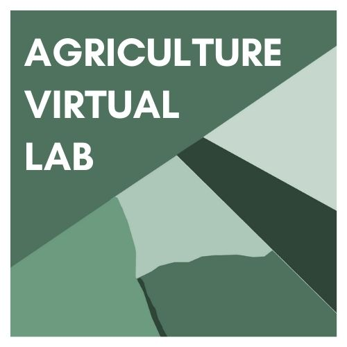

    

# Agriculture Virtual Laboratory Documentation

## Introduction

The Agriculture Virtual Laboratory (AVL) is an integrated, user-friendly online
environment that helps scientists to discover, explore, analyse, and visualize a
wide variety of agricultural earth observation data.

The AVL integrates a data access layer, a thematic processing subsystem (TAO), a
Python scientific stack including the xcube suite for data cube handling, a
web-based interactive lab notebook (JupyterLab), and an online geodata viewer.

## Contents

### User guide

This section provides a guide for scientific users of the Agriculture Virtual
Laboratory, including both the thematic processing and exploitation subsystems,
and descriptions of the AVL-specific command-line and Python interfaces.

1.  [Exploitation subsystem: JupyterLab](guide/exploitation/jupyter.md)
2.  [Exploitation subsystem: xcube viewer](guide/exploitation/viewer.md) <!-- 3. [Exploitation subsystem: xcube catalogue](guide/exploitation/catalogue.md) -->
3.  [Thematic processing subsystem](guide/processing/index.md)
4.  [AVL Python API](api/avl/)
5.  [AVL command-line tools](guide/tools.md)

### Datasets

AVL provides a variety of EO data products from multiple sources (or
collections). They follow a well-defined dataset convention and are grouped
according to sensor type. Most of these datasets are provided via the
thematic processing system but many are also available in the exploitation
system via various xcube data stores.

1.  [Dataset conventions](datasets/conventions.md) for raster datasets
2.  [Altimetric datasets](datasets/altimetric.md) (processing system)
3.  [Atmospheric datasets](datasets/atmospheric.md) (processing system)
4.  [Optical datasets](datasets/optical.md) (processing system)
5.  [Passive microwave datasets](datasets/passive_microwave.md)
    (processing system)
6.  [Radar datasets](datasets/radar.md) (processing system)
7.  [Open datasets](datasets/open_datasets.md) (processing system) 
8.  [Vector datasets](datasets/vector.md) (exploitation system)
9.  [xcube data store datasets](datasets/xcube.md) (exploitation system) 

### Design

This section documents the system design, development resources, test
procedures, and test results.

1.  [Design overview](design/index.md)
2.  [Architecture and common components](design/common.md)
3.  [Processing system design](design/processing/index.md)
4.  [Exploitation system design](design/exploitation/index.md)
5.  [Development infrastructure](design/development.md)
6.  [Software reuse file](design/reuse.md)
7.  [Processing system test procedures and results](design/testing/processing.md)
8.  [Exploitation system test procedures and results](design/testing/exploitation.md)

### About the project

1.  [About the project](about/index.md)
2.  [License](about/license.md)
